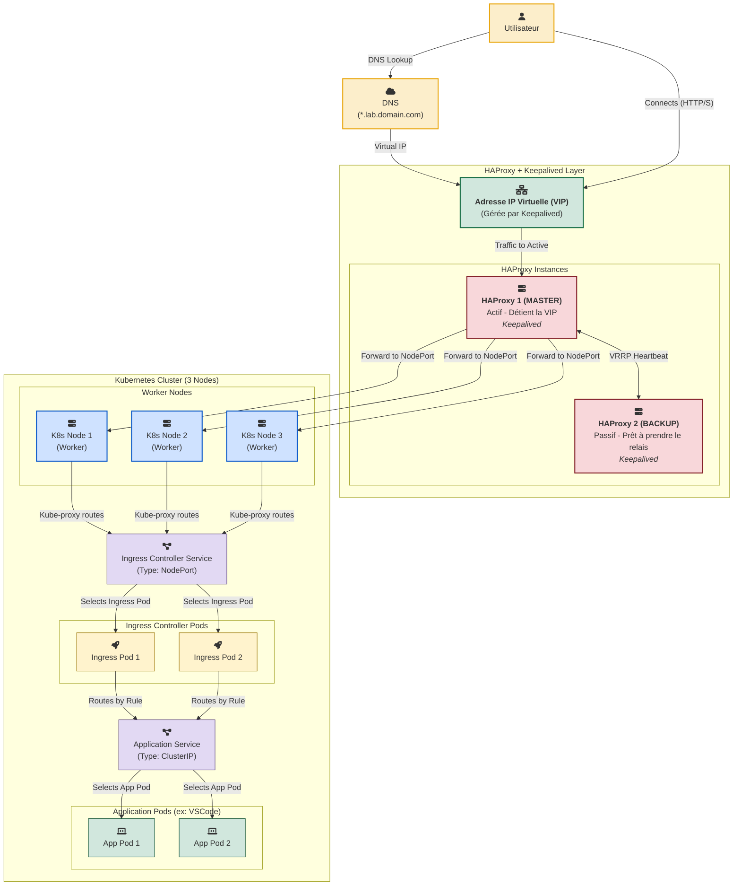

```mermaid
graph TD
    %% --- Style Definitions ---
    classDef default fill:#ececff,stroke:#9370db,stroke-width:2px,color:#333;
    classDef external fill:#fceecb,stroke:#e9a70f,stroke-width:2px,color:#333;
    classDef network fill:#d1e7dd,stroke:#146c43,stroke-width:2px,color:#333;
    classDef haproxy fill:#f8d7da,stroke:#842029,stroke-width:2px,color:#333;
    classDef k8snode fill:#cfe2ff,stroke:#0a58ca,stroke-width:2px,color:#333;
    classDef k8singress fill:#fff3cd,stroke:#997404,stroke-width:1px,color:#333;
    classDef k8sapp fill:#d1e7dd,stroke:#0f5132,stroke-width:1px,color:#333;
    classDef k8ssvc fill:#e2d9f3,stroke:#563d7c,stroke-width:1px,color:#333;

    %% --- External Layer ---
    User["<i class='fa fa-user'></i><br/>Utilisateur"]:::external
    DNS["<i class='fa fa-cloud'></i><br/>DNS<br/>(*.lab.domain.com)"]:::external
    User -- "DNS Lookup" --> DNS

    %% --- HA Layer with Keepalived ---
    subgraph "HAProxy + Keepalived Layer"
        direction TB
        VIP["<i class='fa fa-network-wired fa-lg'></i><br/><b>Adresse IP Virtuelle (VIP)</b><br/>(Gérée par Keepalived)"]:::network

        subgraph "HAProxy Instances"
            direction LR
            HAProxy1["<i class='fa fa-server'></i><br/><b>HAProxy 1 (MASTER)</b><br/>Actif - Détient la VIP<br/><i>Keepalived</i>"]:::haproxy
            HAProxy2["<i class='fa fa-server'></i><br/><b>HAProxy 2 (BACKUP)</b><br/>Passif - Prêt à prendre le relais<br/><i>Keepalived</i>"]:::haproxy
        end
        %% !! Label VRRP sans icône !!
        HAProxy1 <-- "VRRP Heartbeat" --> HAProxy2 
    end

    DNS -- "Virtual IP" --> VIP
    User -- "Connects (HTTP/S)" --> VIP
    VIP -- "Traffic to Active" --> HAProxy1

    %% --- Kubernetes Cluster Layer ---
    subgraph "Kubernetes Cluster (3 Nodes)"
        direction TB

        subgraph "Worker Nodes"
             direction LR
             Node1["<i class='fa fa-server'></i><br/>K8s Node 1<br/>(Worker)"]:::k8snode
             Node2["<i class='fa fa-server'></i><br/>K8s Node 2<br/>(Worker)"]:::k8snode
             Node3["<i class='fa fa-server'></i><br/>K8s Node 3<br/>(Worker)"]:::k8snode
        end

        IngressSvc["<i class='fa fa-project-diagram'></i><br/>Ingress Controller Service<br/>(Type: NodePort)"]:::k8ssvc

        subgraph "Ingress Controller Pods"
            direction LR
             IngressPod1["<i class='fa fa-rocket'></i><br/>Ingress Pod 1"]:::k8singress
             IngressPod2["<i class='fa fa-rocket'></i><br/>Ingress Pod 2"]:::k8singress
        end

        AppSvc["<i class='fa fa-project-diagram'></i><br/>Application Service<br/>(Type: ClusterIP)"]:::k8ssvc

        subgraph "Application Pods (ex: VSCode)"
            direction LR
             AppPod1["<i class='fa fa-laptop-code'></i><br/>App Pod 1"]:::k8sapp
             AppPod2["<i class='fa fa-laptop-code'></i><br/>App Pod 2"]:::k8sapp
        end

        %% --- Traffic Flow inside K8s (Labels ultra-simplifiés) ---
        %% !! Labels sans numéro ni HTML !!
        HAProxy1 -- "Forward to NodePort" --> Node1 
        HAProxy1 -- "Forward to NodePort" --> Node2
        HAProxy1 -- "Forward to NodePort" --> Node3

        Node1 -- "Kube-proxy routes" --> IngressSvc
        Node2 -- "Kube-proxy routes" --> IngressSvc
        Node3 -- "Kube-proxy routes" --> IngressSvc

        IngressSvc -- "Selects Ingress Pod" --> IngressPod1
        IngressSvc -- "Selects Ingress Pod" --> IngressPod2

        IngressPod1 -- "Routes by Rule" --> AppSvc
        IngressPod2 -- "Routes by Rule" --> AppSvc

        AppSvc -- "Selects App Pod" --> AppPod1
        AppSvc -- "Selects App Pod" --> AppPod2

    end
```