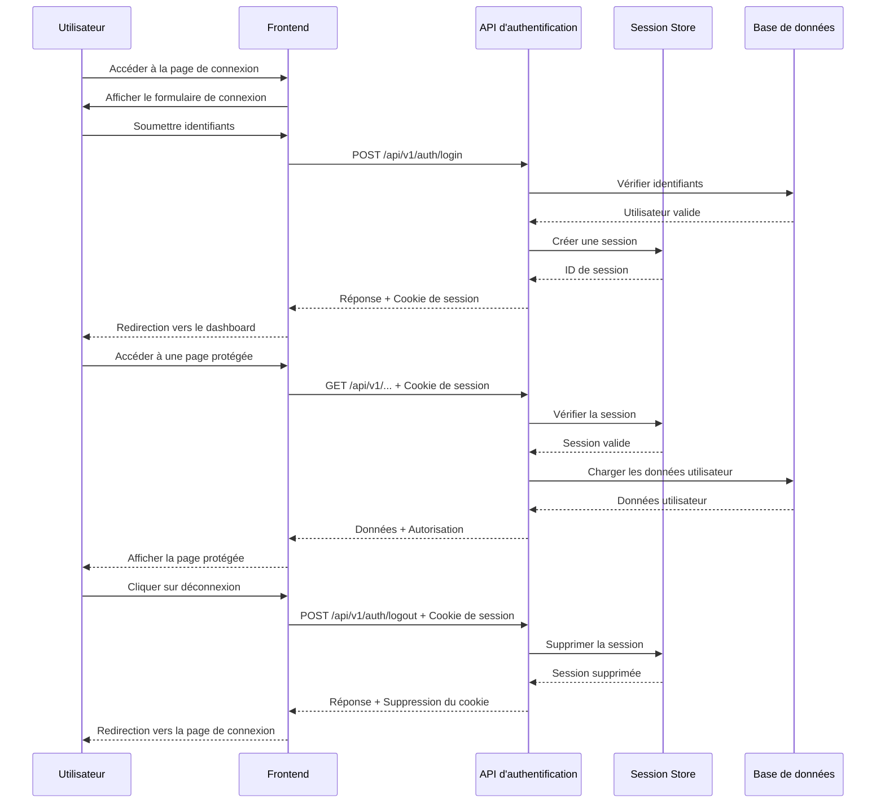

```mermaid
sequenceDiagram
    participant U as Utilisateur
    participant F as Frontend
    participant A as API d'authentification
    participant S as Session Store
    participant DB as Base de données

    %% Flux de connexion
    U->>F: Accéder à la page de connexion
    F->>U: Afficher le formulaire de connexion
    U->>F: Soumettre identifiants
    F->>A: POST /api/v1/auth/login
    A->>DB: Vérifier identifiants
    DB-->>A: Utilisateur valide
    A->>S: Créer une session
    S-->>A: ID de session
    A-->>F: Réponse + Cookie de session
    F-->>U: Redirection vers le dashboard

    %% Flux de requête authentifiée
    U->>F: Accéder à une page protégée
    F->>A: GET /api/v1/... + Cookie de session
    A->>S: Vérifier la session
    S-->>A: Session valide
    A->>DB: Charger les données utilisateur
    DB-->>A: Données utilisateur
    A-->>F: Données + Autorisation
    F-->>U: Afficher la page protégée

    %% Flux de déconnexion
    U->>F: Cliquer sur déconnexion
    F->>A: POST /api/v1/auth/logout + Cookie de session
    A->>S: Supprimer la session
    S-->>A: Session supprimée
    A-->>F: Réponse + Suppression du cookie
    F-->>U: Redirection vers la page de connexion
```
