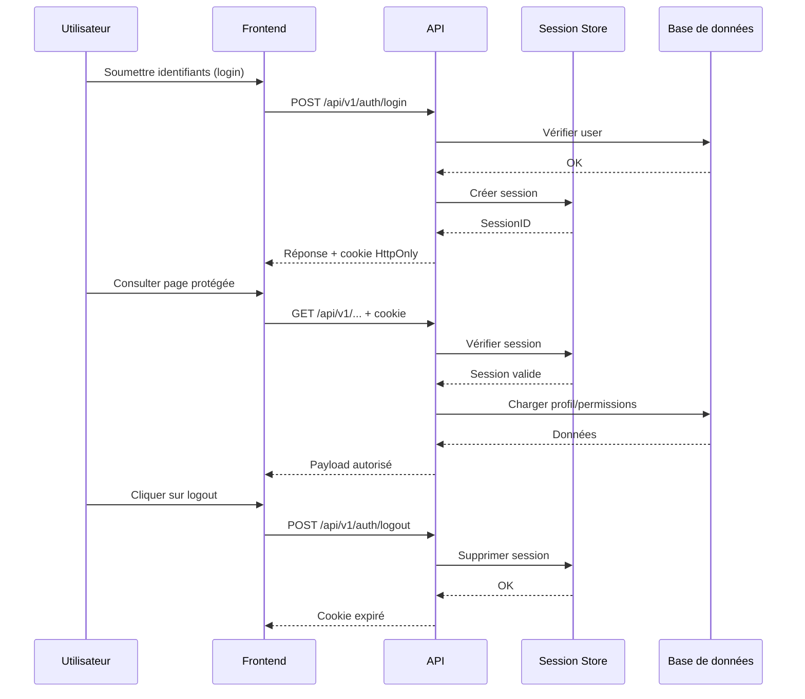

# Authentification LabOnDemand

L'authentification repose sur des sessions serveur conservées dans Redis. Trois rôles sont pris en charge (student, teacher, admin) avec des capacités croissantes. Cette page fusionne le résumé fonctionnel, la description technique et le diagramme de flux.

## Parcours utilisateur

1. **Inscription** (`register.html` + `register.js`) : formulaire complet avec validation côté client, relié à `POST /api/v1/auth/register`.
2. **Connexion** (`login.html` + `login.js`) : soumission vers `POST /api/v1/auth/login`, stockage automatique du cookie HttpOnly.
3. **Dashboard** (`index.html`) : chaque requête XHR embarque le cookie ; l'API valide la session avant de renvoyer les données.
4. **Administration** (`admin.html` + `admin.js`) : CRUD utilisateurs, filtres/pagination, contrôle d'accès basé sur `role`.
5. **Déconnexion** (`POST /api/v1/auth/logout`) : suppression de la session côté Redis et effacement du cookie côté client.

## Aperçu technique

- **Session store** : Redis (service `redis` dans `compose.yaml`), TTL configurable (`SESSION_EXPIRY_HOURS`).
- **Cookies** : HttpOnly, SameSite configurable (`SESSION_SAMESITE`), `SECURE_COOKIES=True` en production.
- **Modèles** : `backend/models.py` (User + rôles), `backend/schemas.py` pour la validation Pydantic.
- **Sécurité** : `backend/security.py` pour le hachage bcrypt et la vérification des mots de passe.
- **Middleware** : `backend/session.py` accroche la session au scope FastAPI.
- **API** : `backend/auth_router.py` expose les endpoints listés ci-dessous.
- **Contrôle d'accès** : `lab_router.py` et `deployment_service.py` consomment `get_current_user`.

## Diagramme de séquence



## Endpoints clés

| Endpoint | Méthode | Description | Accès |
| --- | --- | --- | --- |
| `/api/v1/auth/register` | POST | Créer un utilisateur | Public (activable/désactivable) |
| `/api/v1/auth/login` | POST | Authentifier et créer une session | Public |
| `/api/v1/auth/logout` | POST | Supprimer la session active | Authentifié |
| `/api/v1/auth/me` | GET | Renvoyer le profil courant | Authentifié |
| `/api/v1/auth/check-role` | GET | Vérifier rôle et permissions | Authentifié |
| `/api/v1/auth/users` | GET | Lister les utilisateurs | Admin |
| `/api/v1/auth/users/{id}` | GET/PUT/DELETE | CRUD utilisateur | Admin |

### Exemple de payloads

```json
// POST /api/v1/auth/login
{
  "username": "student1",
  "password": "secret"
}
```

```json
// Réponse typique
{
  "user": {
    "id": 1,
    "username": "student1",
    "email": "student1@example.com",
    "role": "student",
    "is_active": true
  },
  "session_id": "ab12cd34"
}
```

## Fonctionnalités de sécurité

1. **Hachage bcrypt** des mots de passe, abstraction via `security.py`.
2. **Cookies sécurisés** (HttpOnly, SameSite, Secure selon l'environnement).
3. **Rotation des sessions** : TTL configurable et purge lors du logout.
4. **Protection CSRF implicite** via SameSite et absence d'exposition du cookie côté JS.
5. **Validation stricte** des entrées via Pydantic.
6. **Audit** : `backend/logging_config.py` émet `login_attempt`, `login_success`, `login_failure` dans `logs/audit.log`.

## Comptes par défaut

Le script `backend/init_db.py` crée :
- `admin / admin123` (rôle admin)
- Vous pouvez ajouter des comptes enseignants/étudiants via l'UI ou `init_db.py`.

## Tests

Les tests couvrent l'API et l'UI :

```bash
python backend/tests/run_tests.py --backend     # endpoints FastAPI
python backend/tests/run_tests.py --ui          # Selenium (front)
python backend/tests/run_tests.py --all         # combinaison
```

`backend/tests/test_auth.py` couvre les chemins critiques (login/logout/register) et `backend/tests/test_ui.py` exécute les scénarios Selenium (formulaires, redirections, CRUD admin).

## Conseils d'exploitation

- **Surveillance** : inspecter `logs/audit.log` pour détecter des échecs de connexion répétés.
- **Quotas** : les tokens utilisateur alimentent les labels Kubernetes (`user-id`, `user-role`). Voir `documentation/resource-limits.md` pour la propagation côté cluster.
- **Extensibilité** :
  - Ajouter un endpoint 2FA → hooker `security.py`
  - Intégrer un SSO → remplacer/compléter `auth_router.py`
  - Réinitialisation de mot de passe → prévoir un flux dédié et un modèle DB.

## Débogage rapide

| Symptôme | Action |
| --- | --- |
| Sessions expirées trop tôt | Vérifier `SESSION_EXPIRY_HOURS` et l'horloge Redis |
| Cookie non envoyé | Confirmer `COOKIE_DOMAIN` et `SECURE_COOKIES` en fonction du protocole |
| Impossible d'ouvrir l'UI admin | Contrôler le rôle renvoyé par `/api/v1/auth/me` |
| Traces JSON mal formées | S'assurer que `error_handlers.py` est chargé (voir `backend/main.py`) |

Ce document devient la source unique pour l'authentification. Mettez-le à jour à chaque évolution des flux ou des contrôles de sécurité.
