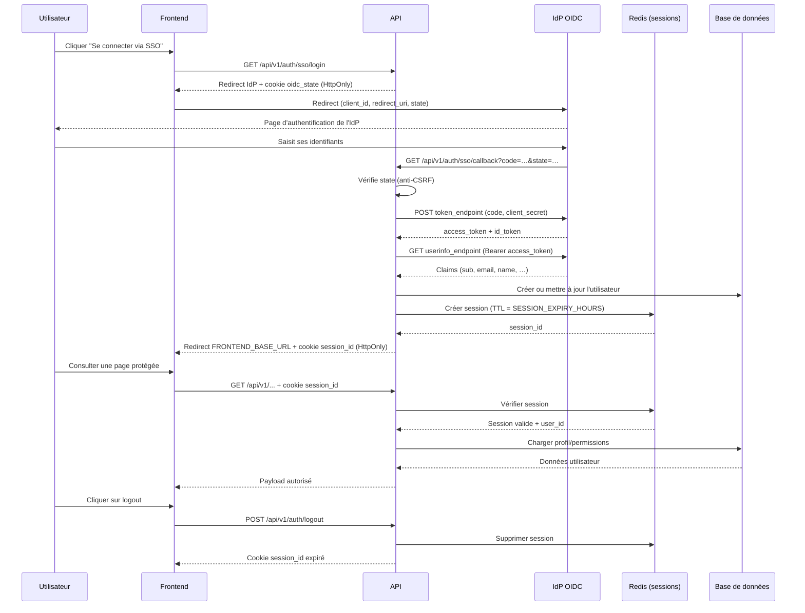

# Authentification LabOnDemand

L'authentification repose sur des sessions serveur conservées dans Redis. Trois rôles sont pris en charge (`student`, `teacher`, `admin`) avec des capacités croissantes.

## Modes d'authentification

LabOnDemand supporte deux modes, configurables via `SSO_ENABLED` :

| Mode | Condition | Description |
| --- | --- | --- |
| **Local** | `SSO_ENABLED=False` | Login/mot de passe via formulaire, gestion des comptes par l'admin |
| **SSO (OIDC)** | `SSO_ENABLED=True` | Délégation à un IdP OpenID Connect (ex : CAS universitaire) |

## Parcours utilisateur

### Mode SSO (OIDC)

1. L'utilisateur clique sur "Se connecter via SSO" sur `login.html`.
2. Le frontend redirige vers `GET /api/v1/auth/sso/login`.
3. L'API génère un `state` anti-CSRF, le stocke dans un cookie `oidc_state`, puis redirige vers l'IdP.
4. Après authentification à l'IdP, celui-ci redirige vers `GET /api/v1/auth/sso/callback?code=…&state=…`.
5. L'API vérifie le `state`, échange le code contre des tokens, récupère les claims utilisateur.
6. L'utilisateur est créé ou mis à jour en base, une session Redis est créée, le cookie `session_id` est posé.
7. Redirection finale vers `FRONTEND_BASE_URL`.

### Mode local

1. Formulaire login (`POST /api/v1/auth/login`) → session Redis → cookie `session_id`.
2. Les comptes sont créés par un admin via `POST /api/v1/auth/register` ou l'interface admin.

> En mode SSO, la création de comptes locaux et le changement de mot de passe sont désactivés.

## Aperçu technique

- **Session store** : Redis (service `redis` dans `compose.yaml`), TTL configurable (`SESSION_EXPIRY_HOURS`).
- **Cookies** : HttpOnly, SameSite configurable (`SESSION_SAMESITE`), `SECURE_COOKIES=True` en production.
- **Modèles** : `backend/models.py` — champ `auth_provider` (`"local"` ou `"oidc"`) et `external_id` (claim `sub` de l'IdP, contraint `UNIQUE` en base).
- **SSO** : `backend/sso.py` — découverte automatique de l'IdP via `/.well-known/openid-configuration`.
- **Sécurité** : `backend/security.py` pour le hachage bcrypt et la vérification des mots de passe.
- **Middleware** : `backend/session.py` accroche la session au scope FastAPI.
- **API** : `backend/auth_router.py` expose les endpoints listés ci-dessous.

## Diagramme de séquence — SSO (OIDC)



## Endpoints

| Endpoint | Méthode | Description | Accès |
| --- | --- | --- | --- |
| `/api/v1/auth/login` | POST | Authentification locale (login + mot de passe) | Public (désactivé si SSO) |
| `/api/v1/auth/register` | POST | Créer un compte local | Admin (désactivé si SSO) |
| `/api/v1/auth/sso/status` | GET | Indique si le SSO est activé | Public |
| `/api/v1/auth/sso/login` | GET | Démarre l'auth OIDC — redirige vers l'IdP | Public |
| `/api/v1/auth/sso/callback` | GET | Callback OIDC — échange le code, crée la session | Public (appelé par l'IdP) |
| `/api/v1/auth/logout` | POST | Supprime la session active | Authentifié |
| `/api/v1/auth/me` | GET | Renvoie le profil courant | Authentifié |
| `/api/v1/auth/check-role` | GET | Vérifie rôle et permissions | Authentifié |
| `/api/v1/auth/change-password` | POST | Changer son propre mot de passe | Authentifié (désactivé si compte OIDC) |
| `/api/v1/auth/users` | GET | Lister les utilisateurs | Admin |
| `/api/v1/auth/users/{id}` | GET/PUT/DELETE | CRUD utilisateur | Admin |
| `/api/v1/auth/users/import` | POST | Import CSV d'utilisateurs | Admin |
| `/api/v1/auth/users/{id}/quota-override` | GET/PUT/DELETE | Dérogation de quota | Admin |
| `/api/v1/auth/me` | PUT | Mettre à jour son propre profil | Authentifié |

## Configuration SSO (OIDC)

### Variables obligatoires (si `SSO_ENABLED=True`)

| Variable | Exemple | Description |
| --- | --- | --- |
| `OIDC_ISSUER` | `https://sso.univ-pau.fr/cas/oidc` | URL de base de l'IdP — la découverte se fait via `{ISSUER}/.well-known/openid-configuration` |
| `OIDC_CLIENT_ID` | `labondemand` | Identifiant de l'application, fourni par la DSI |
| `OIDC_CLIENT_SECRET` | `s3cr3t` | Secret de l'application, fourni par la DSI |
| `OIDC_REDIRECT_URI` | `https://app.fr/api/v1/auth/sso/callback` | URL de callback (doit être enregistrée chez l'IdP) |

> Si `OIDC_REDIRECT_URI` n'est pas définie, l'URL est dérivée automatiquement depuis l'URL de la requête entrante. En production, il vaut mieux la définir explicitement.

### Variables optionnelles — mapping des rôles

| Variable | Défaut | Description |
| --- | --- | --- |
| `OIDC_ROLE_CLAIM` | `eduPersonAffiliation` | Claim OIDC contenant le rôle (standard universités FR) |
| `OIDC_TEACHER_VALUES` | `staff,employee,faculty,enseignant,teacher` | Valeurs du claim qui correspondent au rôle enseignant |
| `OIDC_STUDENT_VALUES` | `student,etudiant` | Valeurs du claim qui correspondent au rôle étudiant |
| `OIDC_DEFAULT_ROLE` | `student` | Rôle attribué si aucune valeur ne correspond |
| `OIDC_EMAIL_FALLBACK_DOMAIN` | `sso.local` | Domaine email de secours si l'IdP ne fournit pas d'email |
| `OIDC_DISCOVERY_TTL_SECONDS` | `3600` | TTL du cache du document de découverte OIDC (en secondes) |

### Cache du document de découverte OIDC

Le document `/.well-known/openid-configuration` de l'IdP (qui contient les URLs
des endpoints `authorization_endpoint`, `token_endpoint`, `userinfo_endpoint`)
est mis en cache côté serveur pour éviter une requête réseau à chaque connexion SSO.

Le cache expire après `OIDC_DISCOVERY_TTL_SECONDS` secondes (défaut : 1 heure).
Si l'IdP change sa configuration (rotation des clés, migration), le cache sera
automatiquement rafraîchi à la prochaine connexion après expiration.

**Comportement en cas de panne de l'IdP** : si le cache est expiré mais que l'IdP
est temporairement inaccessible, le cache périmé est utilisé en fallback plutôt
que de bloquer toutes les connexions SSO. L'événement `oidc_discovery_using_stale_cache`
est journalisé dans `logs/app.log`.

Pour forcer un rafraîchissement immédiat : redémarrer l'API.

### Exemple minimal pour l'Université de Pau

```env
SSO_ENABLED=True
FRONTEND_BASE_URL=https://labondemand.univ-pau.fr

OIDC_ISSUER=https://sso.univ-pau.fr/cas/oidc
OIDC_CLIENT_ID=<fourni par la DSI>
OIDC_CLIENT_SECRET=<fourni par la DSI>
OIDC_REDIRECT_URI=https://labondemand.univ-pau.fr/api/v1/auth/sso/callback

# Mapping optionnel (valeurs par défaut adaptées aux universités FR)
OIDC_ROLE_CLAIM=eduPersonAffiliation
OIDC_TEACHER_VALUES=staff,employee,faculty,enseignant
OIDC_STUDENT_VALUES=student,etudiant
OIDC_DEFAULT_ROLE=student
OIDC_EMAIL_FALLBACK_DOMAIN=univ-pau.fr
```

### Enregistrement de l'application auprès de l'IdP

Pour utiliser le SSO, l'application doit être enregistrée auprès de la DSI :

1. Fournir l'**URL de callback** : `https://<votre-domaine>/api/v1/auth/sso/callback`
2. Préciser le **scope** requis : `openid profile email`
3. Récupérer le `client_id` et le `client_secret` fournis par la DSI
4. Vérifier que l'IdP expose bien `/.well-known/openid-configuration`

### Claims utilisateur utilisés

| Claim OIDC | Utilisation |
| --- | --- |
| `sub` | Identifiant unique de l'utilisateur (`external_id` en base, contraint `UNIQUE`) |
| `email` | Adresse email |
| `name` ou `displayName` | Nom complet |
| `preferred_username` ou `uid` | Nom d'utilisateur |
| `eduPersonAffiliation` (configurable) | Rôle (teacher / student) |

### Gestion des comptes en mode SSO

- À la première connexion SSO, un compte est créé automatiquement avec le rôle déduit des claims.
- Aux connexions suivantes, le profil (nom, email, rôle) est mis à jour depuis l'IdP.
- Le rôle `admin` n'est **jamais** attribué automatiquement — il doit être assigné manuellement via l'interface admin.
- Le mot de passe n'est pas utilisé pour les comptes OIDC (`auth_provider="oidc"`).

### Réconciliation du compte SSO

L'API retrouve le compte existant en deux étapes :
1. Recherche par `external_id = sub` (identifiant unique de l'IdP).
2. Fallback par `email` si `external_id` ne correspond à aucun enregistrement.

Le champ `external_id` est soumis à une contrainte `UNIQUE` en base, ce qui garantit
qu'un seul compte peut exister pour un identifiant SSO donné. Cela empêche la
création de doublons lors de reconnexions successives et protège les déploiements
de l'utilisateur contre une suppression accidentelle par la tâche de nettoyage
des namespaces orphelins (voir `documentation/lifecycle.md`).

## Fonctionnalités de sécurité

1. **Anti-CSRF** : un `state` aléatoire (`secrets.token_urlsafe(32)`) est généré au démarrage du flow OIDC, stocké dans un cookie HttpOnly de 10 minutes, et vérifié au retour du callback.
2. **Hachage bcrypt** des mots de passe pour les comptes locaux.
3. **Cookies sécurisés** : HttpOnly, SameSite, `Secure` selon l'environnement.
4. **TTL de session** : configurable via `SESSION_EXPIRY_HOURS`, purge immédiate au logout.
5. **Validation des entrées** : via Pydantic (schémas dans `backend/schemas.py`).
6. **Rate limiting** : `POST /api/v1/auth/login` limité à 5 tentatives/minute (via `slowapi`).
7. **Audit** : `logs/audit.log` — événements `login_success`, `login_failed`, `logout`, `user_registered`, etc.

## Comptes par défaut

- Un compte `admin` est créé au démarrage si aucun n'existe.
- Le mot de passe initial est défini par `ADMIN_DEFAULT_PASSWORD` (à changer en production).
- En mode SSO, le compte admin local reste accessible pour la gestion des rôles.

## Débogage rapide

| Symptôme | Action |
| --- | --- |
| Bouton SSO redirige mais revient avec une erreur | Vérifier `OIDC_CLIENT_ID`, `OIDC_CLIENT_SECRET` et `OIDC_REDIRECT_URI` (doit correspondre exactement à ce qui est enregistré chez l'IdP) |
| `503 Service Unavailable` au clic SSO | L'IdP est inaccessible — vérifier `OIDC_ISSUER` et la connectivité réseau vers l'IdP |
| `State OIDC invalide` | Cookie `oidc_state` expiré (> 10 min) ou bloqué — vérifier `SECURE_COOKIES` et `COOKIE_DOMAIN` |
| Utilisateur créé sans email | L'IdP ne fournit pas de claim `email` — ajuster `OIDC_EMAIL_FALLBACK_DOMAIN` |
| Tous les utilisateurs SSO sont `student` | Vérifier `OIDC_ROLE_CLAIM` et les valeurs dans `OIDC_TEACHER_VALUES` |
| Sessions expirées trop tôt | Vérifier `SESSION_EXPIRY_HOURS` et l'horloge Redis |
| Cookie non envoyé | Confirmer `COOKIE_DOMAIN` et `SECURE_COOKIES` en fonction du protocole (HTTP vs HTTPS) |
| Impossible d'ouvrir l'UI admin | Contrôler le rôle renvoyé par `GET /api/v1/auth/me` |

## Tests

```bash
python backend/tests/run_tests.py --backend     # endpoints FastAPI
python backend/tests/run_tests.py --ui          # Selenium (front)
python backend/tests/run_tests.py --all         # combinaison
```

`backend/tests/test_auth.py` couvre les chemins critiques (login/logout/register) et `backend/tests/test_ui.py` exécute les scénarios Selenium (formulaires, redirections, CRUD admin).
