# Guide complet enseignant et élève LabOnDemand

Ce document explique le workflow complet d'un TP sur LabOnDemand, du point de
vue enseignant puis du point de vue élève. Il ne couvre volontairement pas
l'administration de la plateforme.

Les captures ont été refaites en **mode clair** le 03 juin 2026 sur
`http://localhost/`.

Comptes utilisés pour les captures :

| Rôle | Identifiant | Mot de passe |
|------|-------------|--------------|
| Enseignant | `prof` | fourni séparément |
| Élève | `test` | fourni séparément |

> Par sécurité, le mot de passe n'est pas écrit dans ce guide. Ne versionnez pas
> de secrets, même pour des comptes de démonstration.

## Résultat attendu

À la fin du workflow, le professeur sait :

1. Créer une classe.
2. Ajouter des élèves existants, créer un compte élève, ou importer un CSV.
3. Créer un devoir avec consigne, livrables, template de lab, ressources et date limite.
4. Configurer des tests automatiques.
5. Distribuer un lab à chaque élève de la classe.
6. Suivre l'état des labs pendant le TP.
7. Consulter les rendus, lancer ou relancer les tests, puis noter.

L'élève sait :

1. Trouver ses devoirs.
2. Lire la consigne et les livrables attendus.
3. Ouvrir son lab si le professeur l'a distribué.
4. Rendre son travail avec un commentaire et des liens.
5. Mettre à jour son rendu tant que le devoir reste accessible.
6. Lire la note et le retour du professeur après correction.

## Le cycle complet d'un TP

Le fonctionnement normal est le suivant :


```mermaid
flowchart LR
  A["Professeur : créer la classe"] --> B["Ajouter les élèves"]
  B --> C["Créer le devoir"]
  C --> D["Configurer le lab et les ressources"]
  D --> E["Configurer les tests automatiques"]
  E --> F["Distribuer à la classe"]
  F --> G["Élève : ouvrir le devoir"]
  G --> H["Élève : travailler dans le lab"]
  H --> I["Élève : déposer le rendu"]
  I --> J["Professeur : lancer tests / corriger"]
  J --> K["Professeur : publier note et feedback"]
```

## Se connecter

Ouvrir `http://localhost/`. La page de connexion s'affiche.

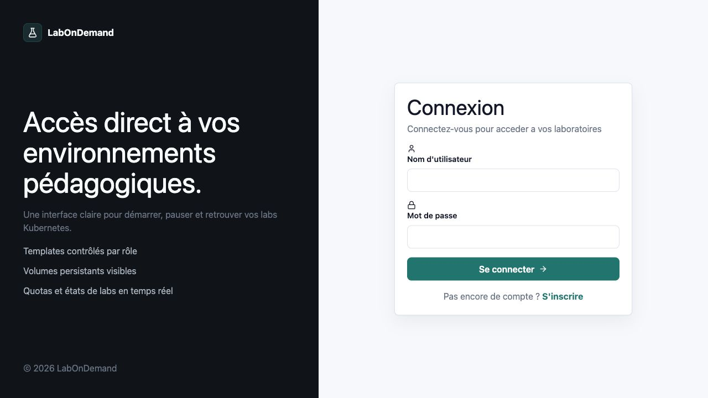

Saisir l'identifiant et le mot de passe, puis cliquer sur **Se connecter**.
Après connexion, le menu change selon le rôle :

| Rôle | Pages principales |
|------|-------------------|
| Enseignant | Accueil, Mes classes |
| Élève | Accueil, Catalogue de labs |

## Partie 1 - Workflow enseignant

### 1. Comprendre l'espace enseignant

Le professeur dispose de deux espaces importants :

| Espace | À quoi il sert |
|--------|----------------|
| **Accueil / Mes Laboratoires** | Gérer ses propres labs de démonstration ou de préparation |
| **Mes classes** | Créer les classes, inscrire les élèves, créer les devoirs, distribuer les labs et corriger |

La page **Mes classes** donne d'abord une vue globale.

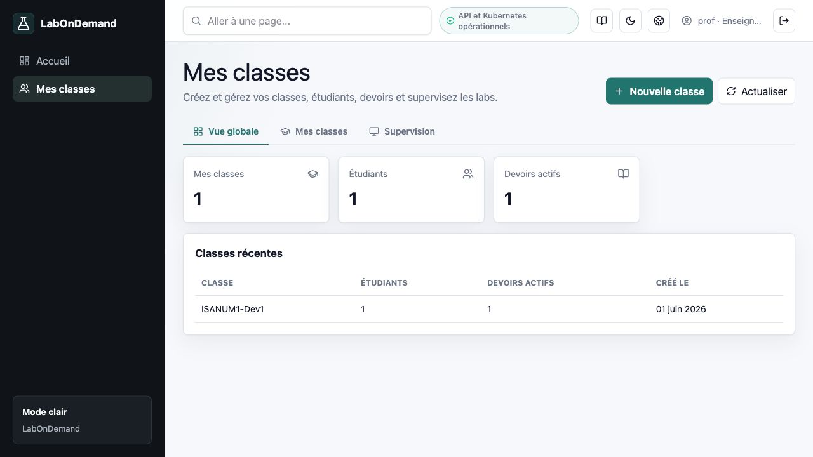

On y voit :

| Élément | Utilité |
|---------|---------|
| Nombre de classes | Vérifier le périmètre du professeur |
| Nombre d'étudiants | Contrôler que les élèves sont bien inscrits |
| Devoirs actifs | Voir combien de devoirs sont disponibles |
| Classes récentes | Retrouver rapidement une classe existante |

### 2. Créer une classe

Aller dans **Mes classes**, puis ouvrir l'onglet **Mes classes**.

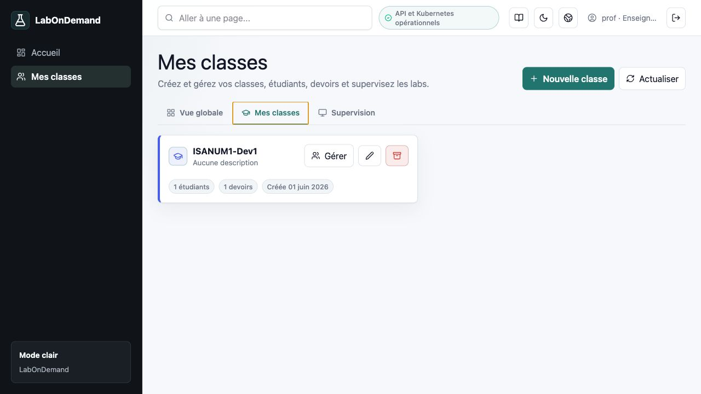

Cliquer sur **Nouvelle classe**.

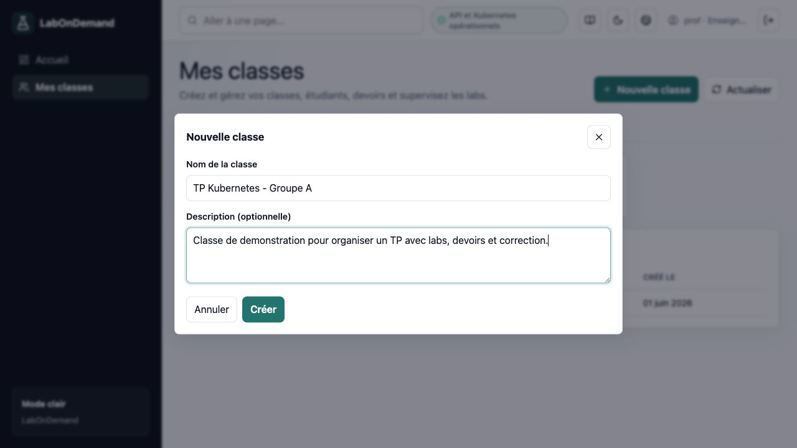

Renseigner :

| Champ | Conseil |
|-------|---------|
| **Nom de la classe** | Utiliser un nom court : `BTS SIO - SLAM 1`, `ISANUM1-Dev1`, `TP Kubernetes - Groupe A` |
| **Description** | Ajouter l'objectif ou le contexte du groupe, si utile |

Cliquer sur **Créer**. La classe apparaît ensuite dans la liste. Le bouton
**Gérer** ouvre l'espace de travail de cette classe.

Bonnes pratiques :

1. Créer une classe par groupe pédagogique réel.
2. Éviter de mélanger plusieurs promotions dans la même classe.
3. Nommer les classes de façon stable, car le nom sera visible par les élèves.

### 3. Gérer les élèves de la classe

Dans une classe, l'onglet **Étudiants** liste les élèves inscrits.

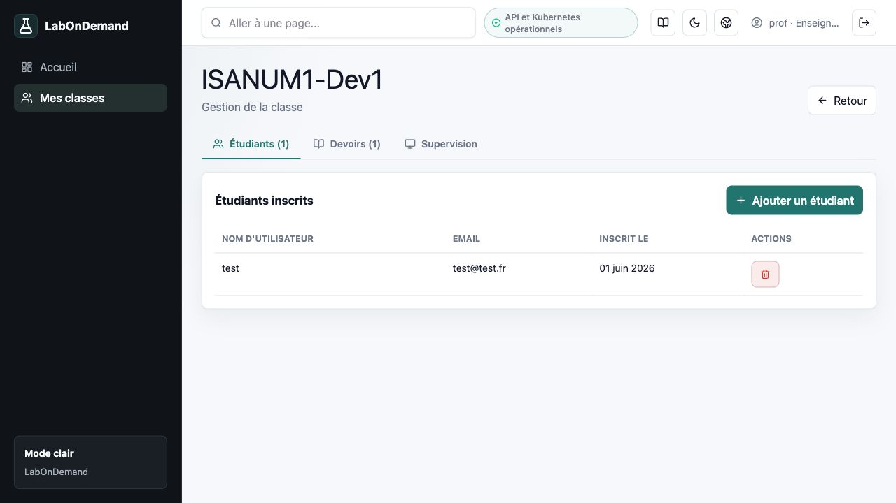

Le tableau affiche :

| Colonne | Description |
|---------|-------------|
| Nom d'utilisateur | Identifiant de connexion de l'élève |
| Email | Adresse associée au compte |
| Inscrit le | Date d'inscription dans la classe |
| Actions | Retirer l'élève de la classe |

Cliquer sur **Ajouter un étudiant** pour inscrire des élèves.

#### Méthode A - Rechercher un compte existant

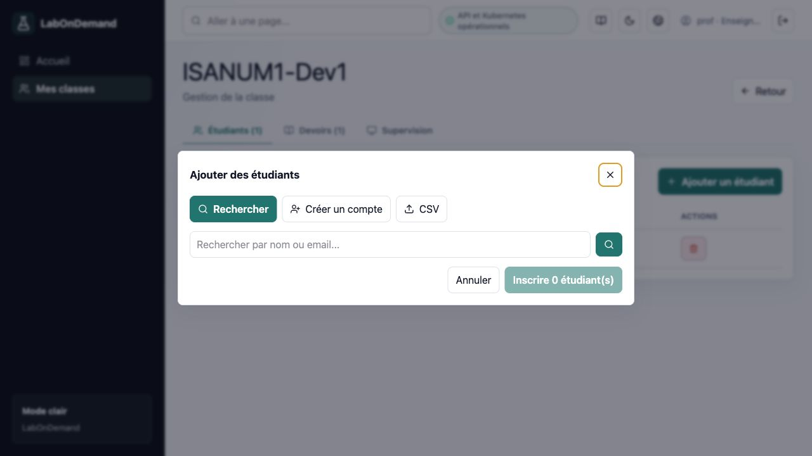

Utiliser cette méthode si les comptes élèves existent déjà.

Étapes :

1. Saisir un nom d'utilisateur ou un email.
2. Lancer la recherche.
3. Cocher les élèves à inscrire.
4. Cliquer sur **Inscrire X étudiant(s)**.

#### Méthode B - Créer un compte élève

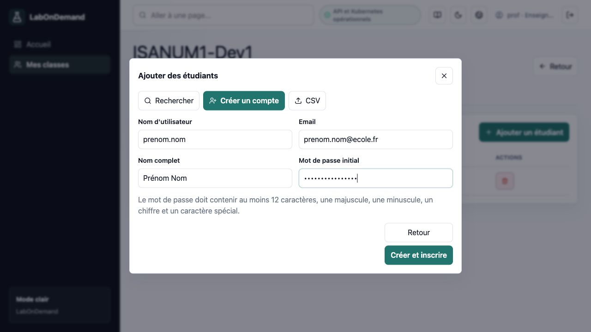

Utiliser cette méthode pour créer un compte et l'inscrire immédiatement dans la
classe.

Champs demandés :

| Champ | Règle |
|-------|-------|
| Nom d'utilisateur | Identifiant de connexion, sans espace de préférence |
| Email | Adresse de l'élève |
| Nom complet | Nom affiché dans les listes |
| Mot de passe initial | Minimum 12 caractères, avec majuscule, minuscule, chiffre et caractère spécial |

Après validation, le compte est créé et inscrit dans la classe.

#### Méthode C - Import CSV

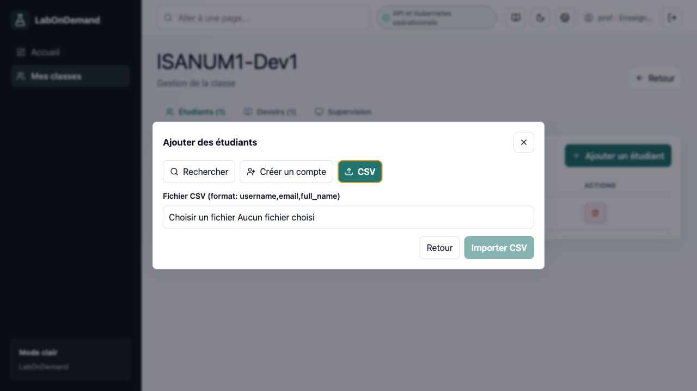

Utiliser cette méthode pour inscrire une promotion entière.

Format attendu :

```csv
username,email,full_name
alice,alice@ecole.fr,Alice Martin
bob,bob@ecole.fr,Bob Durand
```

Conseils :

1. Vérifier les doublons avant import.
2. Utiliser des identifiants simples et cohérents.
3. Garder une copie du CSV hors dépôt si elle contient des données personnelles.

### 4. Créer un devoir

Dans la classe, ouvrir l'onglet **Devoirs**.

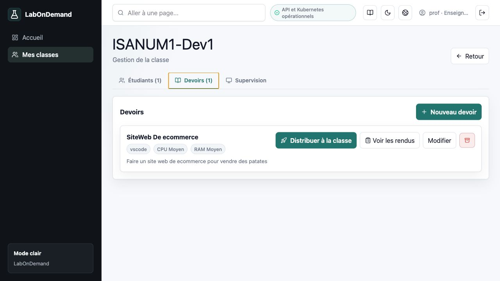

Chaque devoir affiche :

| Élément | Description |
|---------|-------------|
| Titre | Nom du devoir visible par les élèves |
| Template | Type de lab utilisé : VS Code, Jupyter, LAMP, WordPress, etc. |
| CPU / RAM | Ressources attribuées au lab de chaque élève |
| Description courte | Extrait de la consigne |
| Distribuer à la classe | Crée les labs des élèves |
| Voir les rendus | Ouvre le suivi et la correction |
| Modifier | Édite la consigne, les ressources ou les tests |

Cliquer sur **Nouveau devoir**.

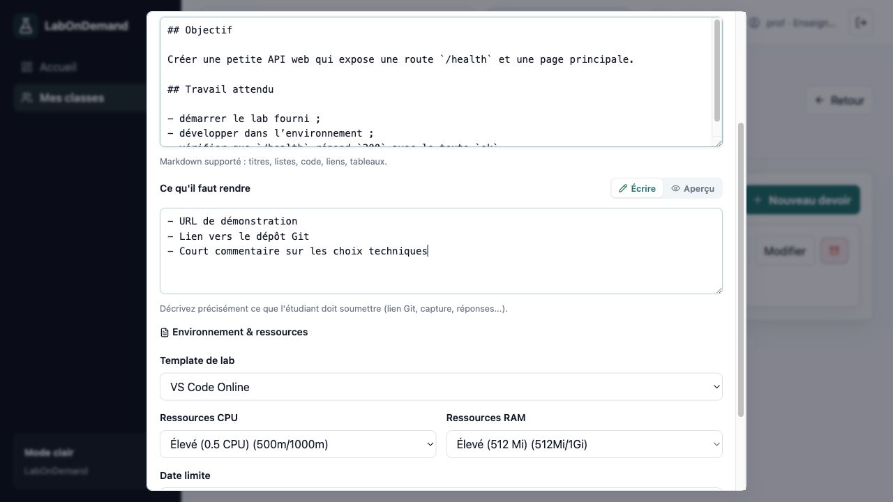

Remplir l'onglet **Énoncé du devoir** :

| Champ | Ce qu'il faut mettre |
|-------|----------------------|
| **Titre du devoir** | Un titre clair : `TP1 - Créer une API web testée` |
| **Énoncé du devoir** | Objectif, contexte, étapes, critères de réussite |
| **Ce qu'il faut rendre** | Ce que l'élève doit déposer : dépôt Git, URL, capture, rapport, réponses |
| **Template de lab** | Environnement fourni à chaque élève |
| **Ressources CPU / RAM** | Profil adapté au travail demandé |
| **Date limite** | Facultatif, mais recommandé pour un rendu évalué |

Le Markdown est supporté. Il est conseillé de structurer la consigne avec :

```markdown
## Objectif

## Travail à faire

## Contraintes

## Livrables attendus

## Critères d'évaluation
```

### 5. Choisir le template et les ressources

Le **template de lab** détermine l'environnement mis à disposition :

| Template | Usage typique |
|----------|---------------|
| VS Code Online | Développement web, scripts, API, exercices de programmation |
| Jupyter Notebook | Python, data, notebooks |
| NetBeans Desktop | Java avec interface graphique distante |
| LAMP | PHP, Apache, MySQL, phpMyAdmin |
| WordPress | CMS avec base de données |
| MySQL + phpMyAdmin | Exercices SQL |

Les ressources CPU/RAM sont appliquées à chaque lab élève. Si une classe a 30
élèves, un devoir trop lourd peut saturer les quotas rapidement. Choisir le plus
petit profil compatible avec le TP.

### 6. Configurer les tests automatiques

Dans le formulaire du devoir, ouvrir l'onglet **Tests automatiques**.

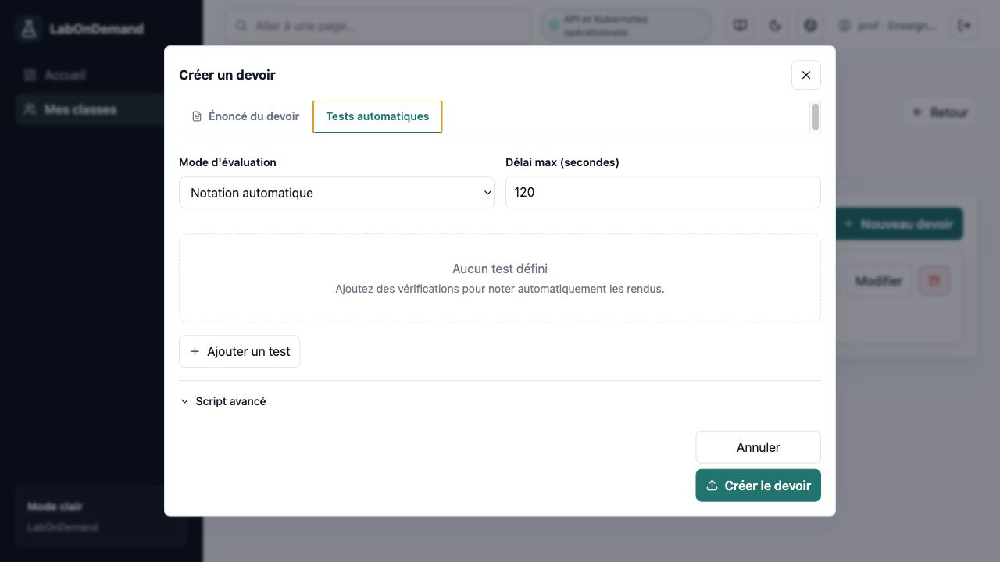

Configurer d'abord le **mode d'évaluation** :

| Mode | Effet |
|------|------|
| **Pas de tests** | Aucun test automatique. Correction manuelle uniquement |
| **Self-check formatif** | L'élève peut lancer les tests pour se vérifier |
| **Notation automatique** | Les tests produisent une suggestion de note pour le professeur |

Définir ensuite le **délai max**. La valeur par défaut est 120 secondes. Pour un
TP web simple, 60 à 120 secondes suffisent souvent.

Cliquer sur **Ajouter un test**.

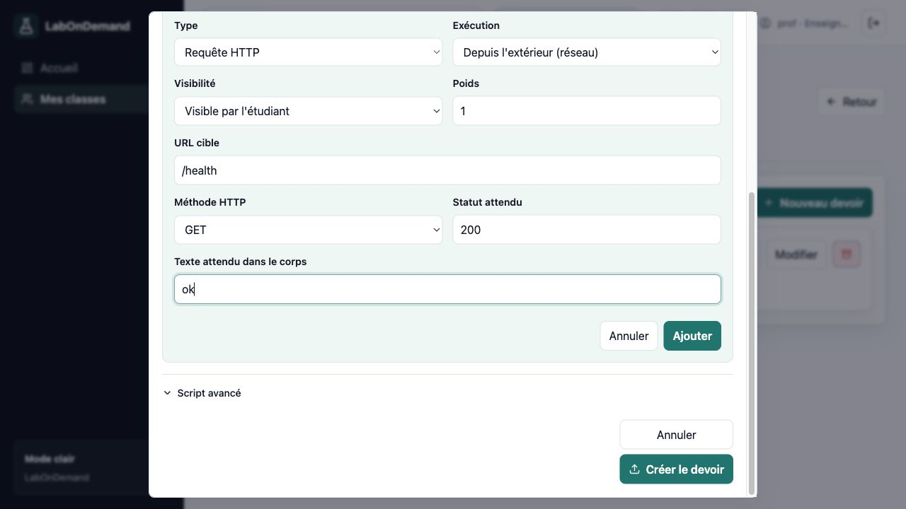

Un test contient toujours :

| Champ | Explication |
|-------|-------------|
| Nom du test | Nom lisible : `La route /health répond 200` |
| Type | HTTP, TCP, SQL, fichier, commande, script |
| Exécution | Depuis l'extérieur du lab ou depuis l'intérieur du pod |
| Visibilité | Ce que l'élève verra du résultat |
| Poids | Importance du test dans la note suggérée |

Types de tests disponibles :

| Type | Exemple |
|------|---------|
| HTTP | Vérifier que `/health` répond `200` et contient `ok` |
| TCP | Vérifier qu'un port est ouvert, par exemple `3306` |
| SQL | Exécuter une requête et attendre un nombre minimal de lignes |
| Fichier | Vérifier la présence ou le contenu d'un fichier |
| Commande | Exécuter une commande dans le pod |
| Script avancé | Écrire un script personnalisé de correction |

Visibilité :

| Visibilité | Ce que voit l'élève |
|------------|---------------------|
| Visible par l'étudiant | Résultat détaillé |
| Résumé seulement | Succès/échec sans détail sensible |
| Professeur uniquement | Masqué côté élève |

Après avoir cliqué sur **Ajouter**, le test apparaît dans la liste.

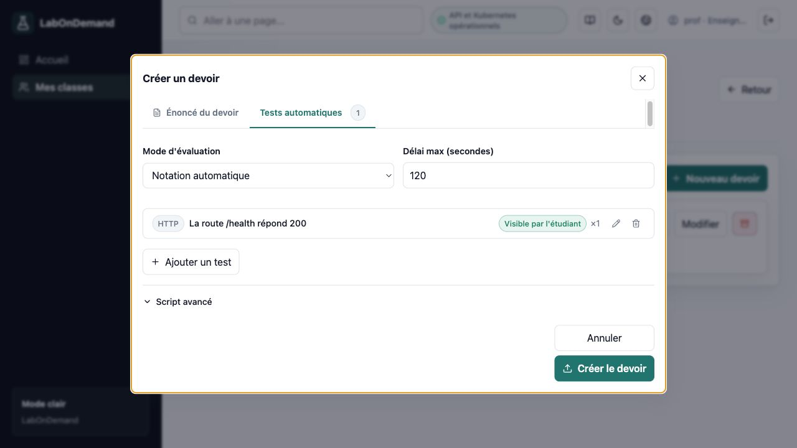

Bonnes pratiques pour les tests :

1. Tester des comportements observables, pas seulement des fichiers internes.
2. Commencer par 2 ou 3 tests simples.
3. Garder au moins une partie de correction manuelle.
4. Ne pas rendre visibles les tests qui révèlent directement la solution.
5. Utiliser des poids cohérents : par exemple 1 pour un test mineur, 3 pour un critère important.

### 7. Distribuer le devoir et les labs à la classe

Une fois le devoir créé, cliquer sur **Distribuer à la classe**.

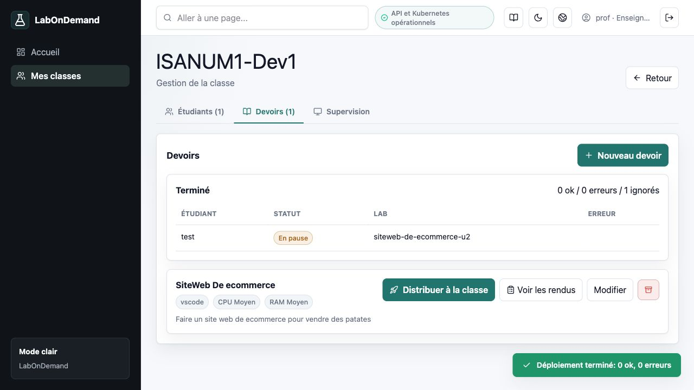

Cette action lance un déploiement en masse :

1. La plateforme parcourt les élèves inscrits.
2. Elle crée un lab dans le namespace de chaque élève.
3. Elle applique le template et les ressources du devoir.
4. Elle affiche un rapport de distribution.

Le rapport contient :

| Statut | Signification |
|--------|---------------|
| `ok` | Lab créé pour l'élève |
| `ignoré` | Un lab existait déjà pour ce devoir |
| `erreur` | Le lab n'a pas pu être créé |

Si un élève est `ignoré`, ce n'est pas forcément un problème : cela signifie
souvent que son lab existe déjà. Si un élève est en `erreur`, vérifier les
quotas, le template et l'état Kubernetes.

### 8. Superviser les labs pendant le TP

Ouvrir l'onglet **Supervision** de la classe.

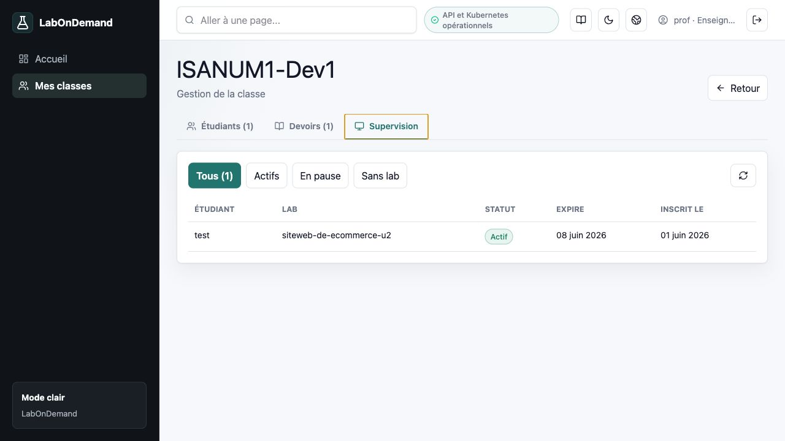

Le professeur voit :

| Colonne | Description |
|---------|-------------|
| Étudiant | Élève concerné |
| Lab | Nom du lab associé |
| Statut | Actif, en pause, sans lab |
| Expire | Date d'expiration du lab |
| Inscrit le | Date d'inscription dans la classe |

Utiliser les filtres :

| Filtre | Utilisation |
|--------|-------------|
| Tous | Vue complète de la classe |
| Actifs | Élèves qui ont un lab utilisable |
| En pause | Labs arrêtés temporairement |
| Sans lab | Élèves pour lesquels la distribution manque ou a échoué |

Pendant une séance, cet écran sert à détecter rapidement les élèves bloqués.

### 9. Suivre les rendus et lancer les tests côté professeur

Depuis l'onglet **Devoirs**, cliquer sur **Voir les rendus**.

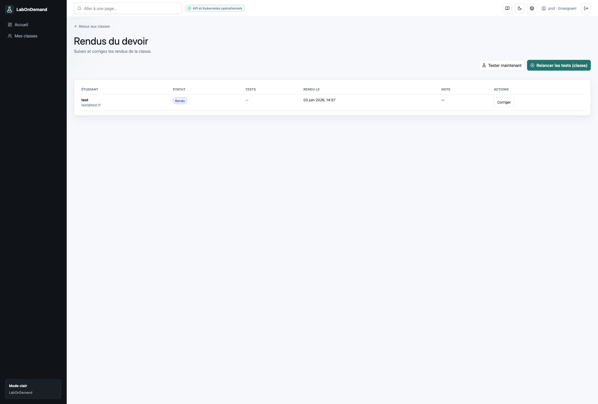

La page affiche une ligne par élève inscrit.

| Colonne | Description |
|---------|-------------|
| Étudiant | Nom et email |
| Statut | À faire, Rendu, Rendu en retard, Corrigé |
| Tests | Verdict du dernier run automatique |
| Rendu le | Date de soumission |
| Note | Note publiée |
| Actions | Corriger le rendu |

Deux boutons sont importants :

| Bouton | Rôle |
|--------|------|
| **Tester maintenant** | Lance les tests sur le lab de démonstration du professeur |
| **Relancer les tests (classe)** | Lance les tests pour les élèves de la classe ayant un lab |

Les tests doivent avoir été configurés dans le devoir. Sans tests, ces boutons
ne produisent pas de correction utile.

### 10. Corriger et noter un rendu

Quand un élève a rendu, cliquer sur **Corriger**.

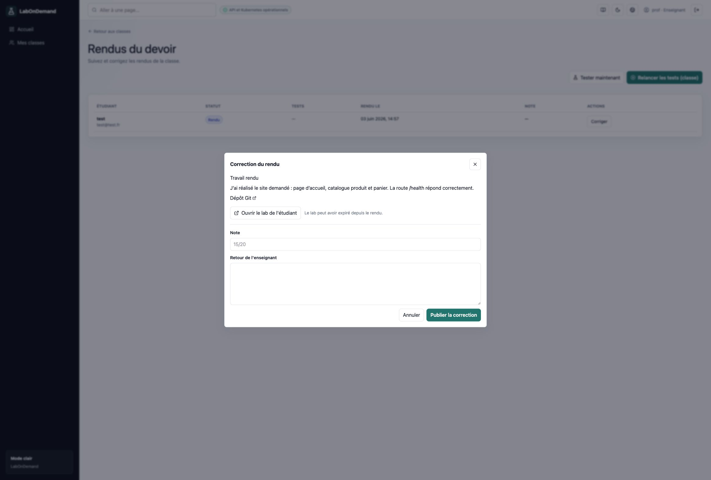

La fenêtre de correction affiche :

| Zone | Utilisation |
|------|-------------|
| Travail rendu | Commentaire de l'élève |
| Liens | Dépôt Git, URL de démo ou autres livrables |
| Ouvrir le lab de l'étudiant | Accès au lab tel qu'il existait au moment du rendu, si encore disponible |
| Résultats de tests | Affichés si des tests automatiques ont tourné |
| Note | Note finale décidée par le professeur |
| Retour de l'enseignant | Feedback visible par l'élève |

Remplir la note et le feedback, puis cliquer sur **Publier la correction**.

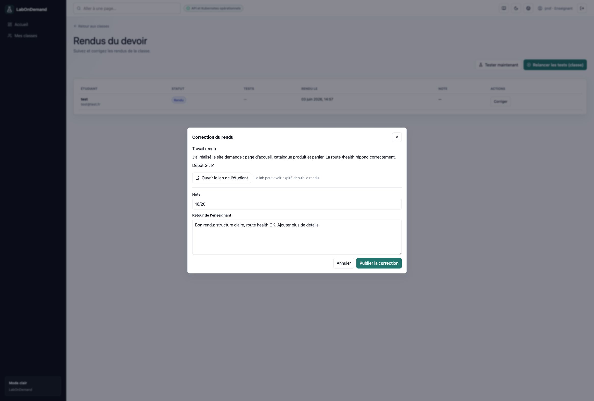

Même si les tests automatiques proposent une note, le professeur garde la main :
la note finale peut être ajustée avant publication.

## Partie 2 - Workflow élève

### 1. Voir ses devoirs

Après connexion, l'élève arrive sur **Mes devoirs**.

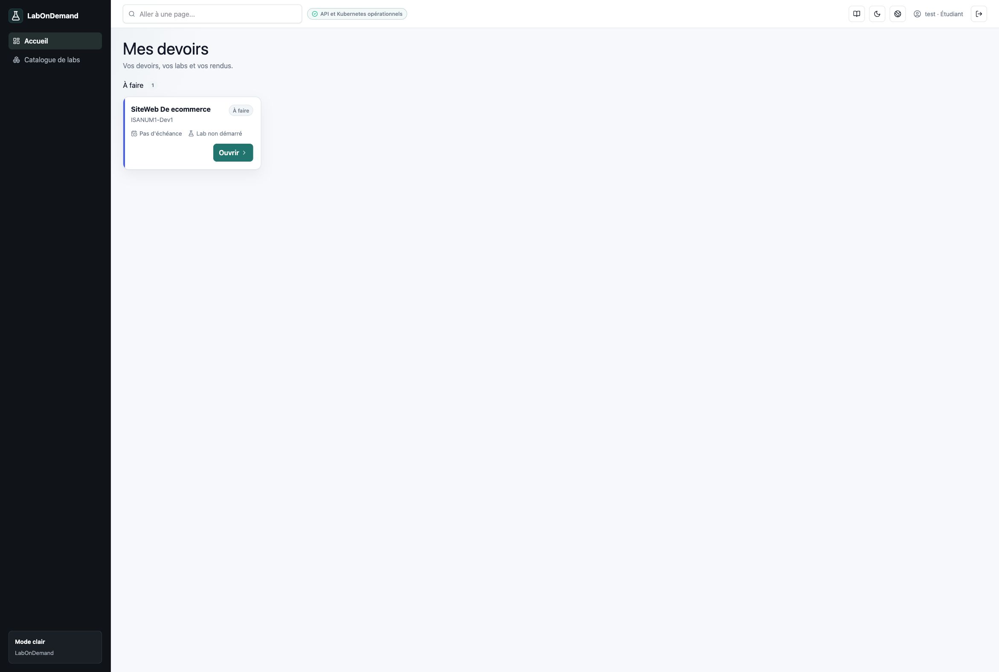

Chaque carte indique :

| Information | Description |
|-------------|-------------|
| Titre | Nom du devoir |
| Classe | Classe associée |
| Statut | À faire, Rendu, Corrigé |
| Échéance | Date limite ou absence d'échéance |
| Lab | Lab prêt ou non démarré |

Cliquer sur **Ouvrir** pour accéder au détail.

### 2. Lire la consigne et vérifier le lab

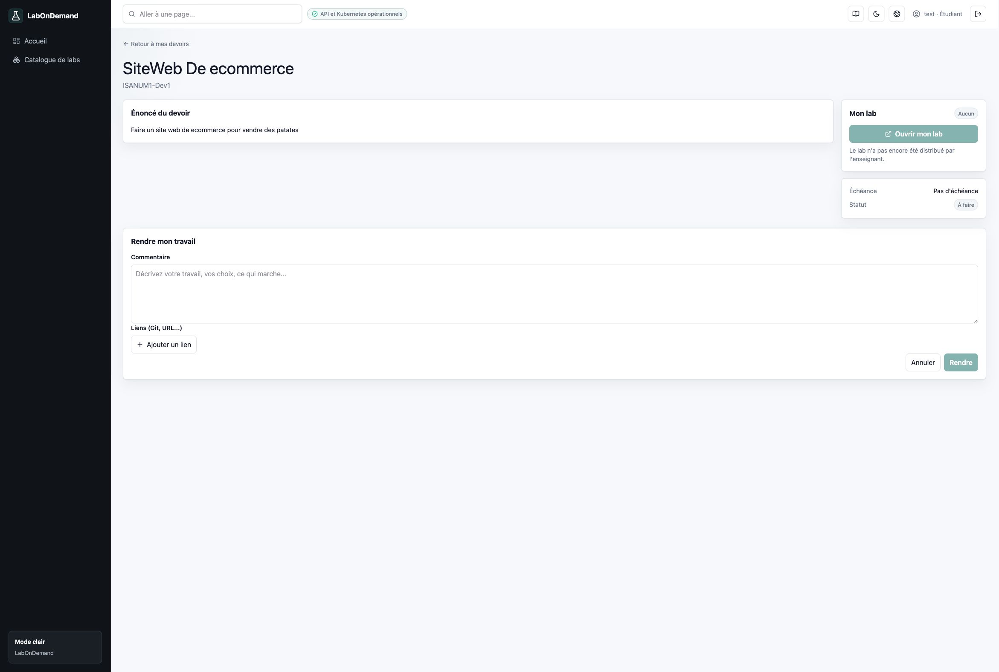

La page contient :

| Zone | Description |
|------|-------------|
| Énoncé du devoir | Consigne écrite par le professeur |
| Ce qu'il faut rendre | Livrables attendus, si renseignés |
| Mon lab | Bouton d'accès au lab si distribué |
| Échéance / Statut | Suivi du devoir |
| Rendre mon travail | Formulaire de soumission |

Si le panneau **Mon lab** indique que le lab n'a pas encore été distribué,
l'élève doit prévenir le professeur. Côté professeur, il faut revenir dans le
devoir et cliquer sur **Distribuer à la classe**.

### 3. Travailler dans le lab

Quand le lab est prêt, cliquer sur **Ouvrir mon lab**. Selon le template, l'élève
peut arriver sur VS Code Online, Jupyter, NetBeans, LAMP, WordPress ou une autre
application.

Conseils à donner aux élèves :

1. Ne pas supprimer son lab sans consigne du professeur.
2. Sauvegarder régulièrement le travail.
3. Garder le lien du dépôt ou de la démonstration pour le rendu.
4. Utiliser les tests self-check si le professeur les a activés.

### 4. Rendre son travail

Dans la section **Rendre mon travail**, l'élève renseigne un commentaire et au
moins un lien si demandé.

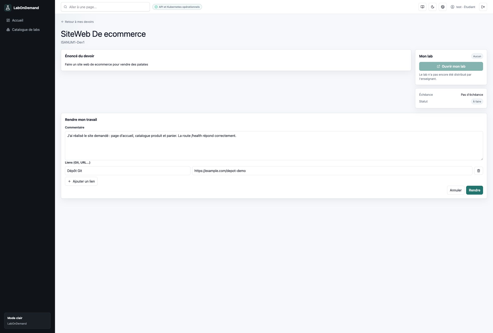

Étapes :

1. Décrire ce qui a été réalisé.
2. Cliquer sur **Ajouter un lien**.
3. Saisir un libellé clair : `Dépôt Git`, `URL de démonstration`, `Capture`.
4. Coller l'URL.
5. Cliquer sur **Rendre**.

Après validation, le statut passe à **Rendu**.

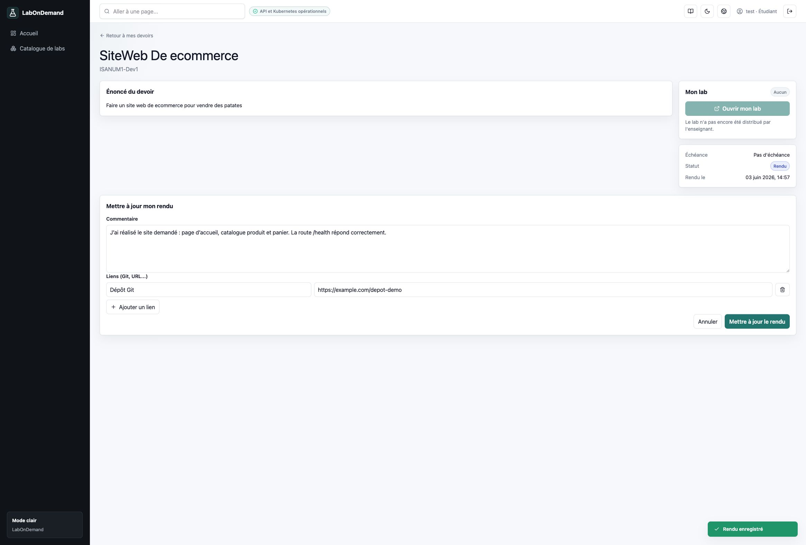

Si l'élève revient sur la page, le formulaire devient **Mettre à jour mon rendu**.
Il peut modifier son commentaire ou ses liens tant que la plateforme l'autorise.

### 5. Lire la correction

Quand le professeur publie une correction :

1. Le devoir passe au statut **Corrigé**.
2. La note apparaît dans la carte du devoir.
3. Le feedback du professeur est visible dans le détail du devoir.

## Checklist professeur avant une séance

Avant de lancer un TP, vérifier :

| Point | Question à se poser |
|-------|---------------------|
| Classe | La bonne classe existe-t-elle ? |
| Élèves | Tous les élèves sont-ils inscrits ? |
| Devoir | Le titre et la consigne sont-ils compréhensibles ? |
| Livrables | L'élève sait-il exactement quoi rendre ? |
| Template | Le lab correspond-il au TP ? |
| Ressources | Les quotas suffisent-ils pour toute la classe ? |
| Tests | Les tests sont-ils configurés et non ambigus ? |
| Visibilité | Les tests visibles ne donnent-ils pas la solution ? |
| Distribution | Le bouton **Distribuer à la classe** a-t-il été utilisé ? |
| Supervision | Les élèves apparaissent-ils avec un lab actif ? |

## Checklist élève à communiquer

Avant de rendre, l'élève doit vérifier :

| Point | Attendu |
|-------|---------|
| Consigne | L'objectif est compris |
| Lab | Le lab est ouvert et le travail est sauvegardé |
| Tests | Les tests disponibles ont été lancés si demandé |
| Commentaire | Le rendu explique ce qui a été fait |
| Liens | Les liens fonctionnent et pointent vers le bon travail |
| Rendu | Le statut affiche **Rendu** après validation |

## Dépannage rapide

### Un élève ne voit pas le devoir

Vérifier :

1. L'élève est inscrit dans la bonne classe.
2. Le devoir n'est pas archivé.
3. L'élève utilise le bon compte.

### Un élève voit le devoir mais pas le lab

Vérifier :

1. Le professeur a cliqué sur **Distribuer à la classe**.
2. Le rapport de distribution ne contient pas d'erreur.
3. L'élève n'apparaît pas dans le filtre **Sans lab** de la supervision.
4. Les quotas CPU/RAM/applications ne sont pas dépassés.

### Les tests automatiques ne donnent pas de résultat

Vérifier :

1. Le mode n'est pas **Pas de tests**.
2. Au moins un test ou script avancé est enregistré.
3. Le lab de l'élève est actif.
4. Le délai max est suffisant.
5. Le test utilise une URL, un port ou une requête correcte.

### Un rendu ne peut pas être noté

Vérifier :

1. L'élève a bien cliqué sur **Rendre**.
2. Le statut est **Rendu** ou **Rendu en retard**.
3. Le professeur est sur **Voir les rendus** du bon devoir.

## À retenir

Le workflow essentiel est :

1. **Créer la classe**.
2. **Ajouter les élèves**.
3. **Créer le devoir**.
4. **Configurer les tests** si le TP doit être évalué automatiquement.
5. **Distribuer à la classe** pour créer les labs élèves.
6. **Superviser** pendant le TP.
7. **Lire les rendus**.
8. **Relancer les tests** si nécessaire.
9. **Corriger et publier la note**.

