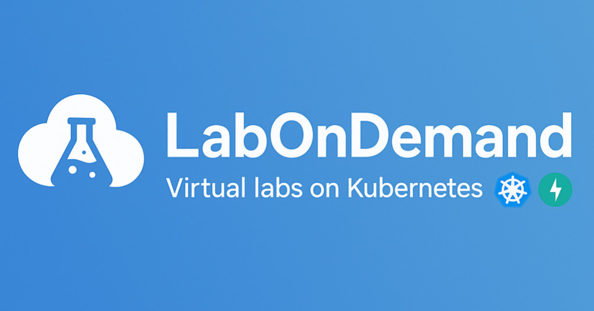
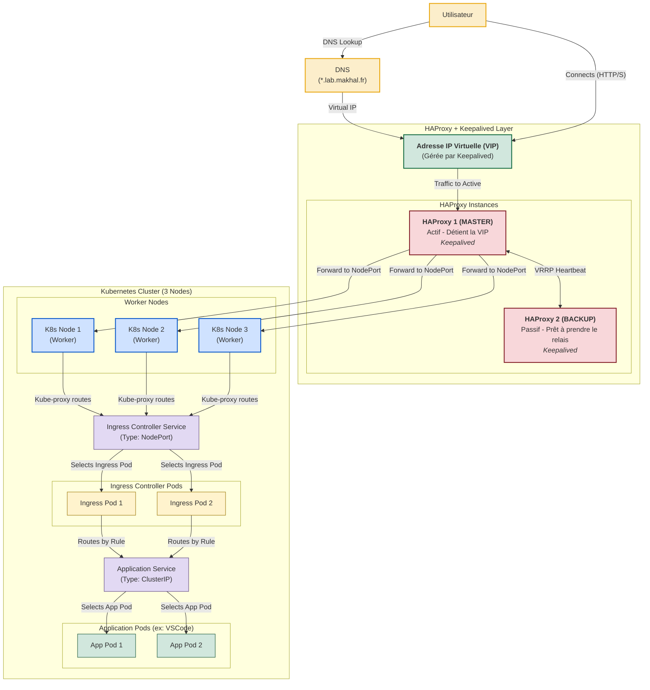
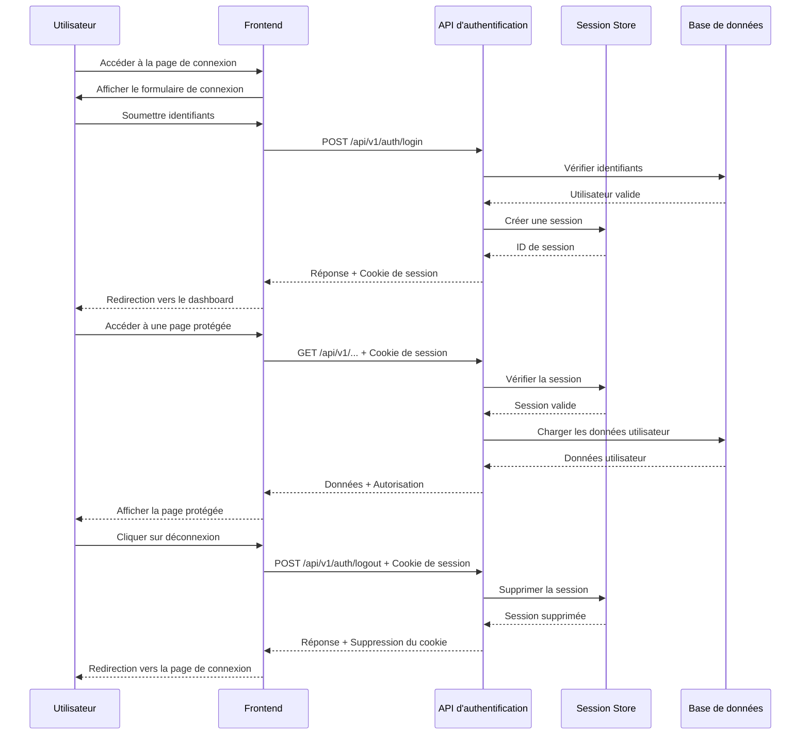
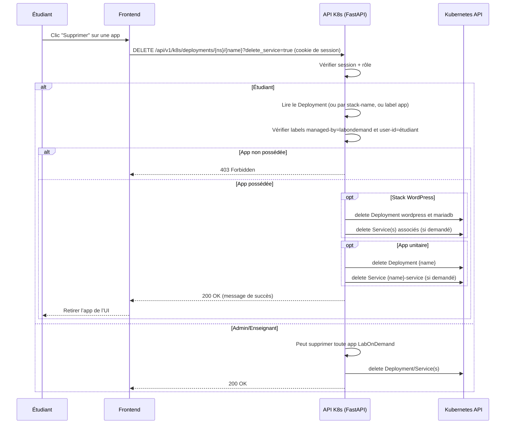
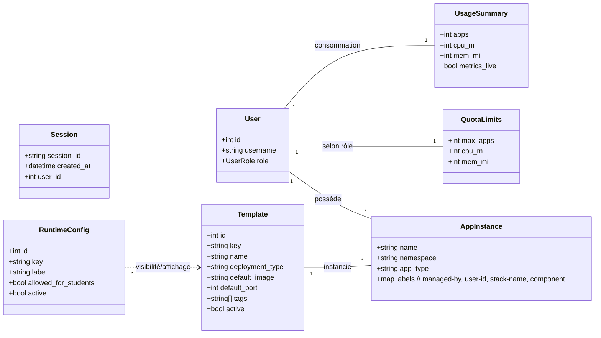

# LabOnDemand ✨

<div align="center">
    <h2 align="center"><a href="https://makhal.fr"></a></h2>
</div>

**LabOnDemand** est une plateforme open-source de gestion de laboratoires virtuels, conçue pour permettre aux étudiants et professeurs de créer et gérer facilement des environnements de travail isolés sur Kubernetes. Déployez des instances VS Code, Jupyter Notebooks, ou vos propres applications conteneurisées en quelques clics !

[](https://www.gnu.org/licenses/agpl-3.0)
<!-- Ajoutez d'autres badges ici (build status, etc.) quand ils seront pertinents -->

## 📹 Présentation du Projet

Regardez notre vidéo de présentation qui explique les principales fonctionnalités et l'utilisation de LabOnDemand :

[](Diagrammes/Video/LabOnDemand.mp4)

## 🚀 Fonctionnalités Clés

*   Déploiement Facile : UI pour lancer des environnements pré-configurés (VS Code, Jupyter, WordPress) ou des images Docker personnalisées.
*   Gestion Kubernetes Simplifiée : création de Deployments/Services, labels standardisés, et conformité K8s (validation des noms).
*   Rôles & Autorisations : étudiants, enseignants, admins. Les étudiants peuvent supprimer uniquement leurs propres applications (contrôle d’étiquettes managed-by=labondemand, user-id).
*   Quotas par Rôle (enforcement côté serveur) : limites sur nombre d’apps, CPU et mémoire avec mode fail-closed si la mesure est indisponible. Carte de quotas sur le dashboard.
*   Observabilité par Application : métriques CPU (m) et mémoire (Mi) par application, en Live (metrics-server) ou estimation (requests). Liste triable par consommation.
*   Statistiques Admin : vue dédiée pour l’état cluster/noeuds (si metrics-server présent), avec agrégations utiles.
*   WordPress pour Étudiants : stack complète WordPress + MariaDB gérée; suppression traite la stack (web + db) proprement.
*   Sécurité des Sessions : cookies HttpOnly, Secure, SameSite, domaine/expiration configurables; contrôles de rôle côté API.
*   Sessions distribuées via Redis : stockage des sessions dans Redis externe pour scalabilité et HA (plus de SPOF en mémoire).
*   Accès Simplifié : exposition via NodePort (par défaut), configurable.
*   Templates Dynamiques : templates en base (icône/desc/tags) + runtime-configs pour piloter l’affichage aux étudiants.
*   Terminal Web intégré (sans SSH) : terminal in-browser vers un pod, avec Xterm.js (fit/attach/webgl), resize dynamique, keepalive, faible latence. Accès DB pods restreint pour les étudiants.
*   Stack LAMP clé en main : Apache+PHP, MySQL, phpMyAdmin avec plusieurs URLs dans les détails de déploiement; index.php par défaut stylé UPPA; web non-root et capacités minimales.
*   Persistance « best-effort » : montages PVC pour VS Code, Jupyter et le web LAMP (fallback en emptyDir si StorageClass indisponible). MariaDB/WordPress DB en PVC 1Gi par défaut.

Voir aussi:
- Documentation LAMP: documentation/lamp.md
- Terminal web: documentation/terminal.md
- WordPress: documentation/wordpress.md

## Quotas pour les étudiants (valeurs et justification)

Pour garantir une expérience fluide pour tous et éviter la saturation du cluster par un seul utilisateur, des quotas spécifiques s’appliquent aux comptes « étudiant ».

- Applications (logiques): 4 max — une stack WordPress (web + DB) compte pour 1 application.
- Pods: 6 max — permet 2 apps mono-pod + 1 stack WordPress (2 pods) avec une marge.
- Somme des requests CPU: 2500m par namespace étudiant.
- Somme des requests mémoire: 6Gi par namespace étudiant.
- Objets K8s: jusqu’à 8 Deployments et 10 Services.
- Stockage: jusqu’à 2 PVC et 2Gi de requests.storage.
- Plafonds par conteneur (côté API/LimitRange):
    - CPU: request ≤ 500m, limit ≤ 1000m
    - Mémoire: request ≤ 512Mi, limit ≤ 1Gi
    - Réplicas: ≤ 1 par application étudiante

Pourquoi ces limites ? Exemple concret:

- Cas d’usage visé: un étudiant lance 2 environnements VS Code + 1 WordPress (web + DB).
- Ressources typiques par pod (defaults/maximums étudiants): 500m CPU, 512Mi mémoire.
- Consommation totale: 4 pods × (500m, 512Mi) = 2000m CPU et ~2Gi mémoire — bien sous les plafonds (2500m, 6Gi), laissant:
    - ~500m CPU pour respirer (pics, tâches système)
    - ~4Gi de mémoire de marge (évite l’OOM et conserve de la capacité cluster)

Ce dimensionnement:

- offre une vraie autonomie (plusieurs ateliers en parallèle),
- reste aligné avec les bonnes pratiques Kubernetes (requests réalistes, limits raisonnables),
- protège l’infrastructure partagée des abus involontaires.

Où c’est implémenté dans le code:

- `backend/k8s_utils.py`
    - `get_role_limits('student')` → max_apps=4, max_requests_cpu_m=2500, max_requests_mem_mi=6144, max_pods=6
    - `ensure_namespace_baseline()` → ResourceQuota (pods, requests.cpu=2500m, requests.memory=6Gi, limits.cpu=5, limits.memory=8Gi, counts Deployments/Services, PVC/requests.storage) et LimitRange (defaults/requests)
    - `clamp_resources_for_role('student', ...)` → plafonds par conteneur et réplicas
- `backend/deployment_service.py`
    - `_assert_user_quota()` et prévalidation K8s → refus explicite si dépassement
    - `get_user_quota_summary()` → données pour la carte « Vos ressources »
- UI: carte Quotas sur le dashboard (`frontend/index.html`, `frontend/script.js`) alimentée par `GET /api/v1/quotas/me`.


## �🏗️ Architecture du Projet

LabOnDemand est structuré autour de trois composants principaux :

1.  **Backend API (FastAPI/Python)** : Le cerveau de l'application. Il gère la logique métier, les interactions avec l'API Kubernetes et expose les endpoints pour le frontend.
2.  **Frontend (HTML/JavaScript/CSS)** : L'interface utilisateur web, permettant aux utilisateurs d'interagir avec l'API pour gérer leurs laboratoires.
3.  **Base de Données (MariaDB)** : Utilisée pour stocker les informations relatives aux laboratoires, utilisateurs (fonctionnalité future), et configurations.
4.  **Proxy NGINX** : Sert le frontend statique et redirige les appels API vers le backend FastAPI.

##  visionary Architecture (Objectif à Terme)

L'objectif est de faire évoluer LabOnDemand vers une solution robuste et hautement disponible :



## 🛠️ Mise en Place (Développement Local)

### Prérequis

*   **Docker & Docker Compose :** Pour construire et lancer les services localement.
*   **Cluster Kubernetes Fonctionnel :** Minikube, Kind, K3s, ou un cluster distant.
*   **`kubectl` :** Configuré pour interagir avec votre cluster.
*   **Helm (Optionnel, mais recommandé) :** Pour l'installation de l'Ingress Controller.
*   **Fichier `kubeconfig` :** Un fichier `kubeconfig` valide pour l'accès à votre cluster Kubernetes.

Conseil stockage (dev): pour bénéficier de la persistance best-effort (PVC), assurez-vous qu’une StorageClass par défaut est disponible (ex. local-path sur k3s). Sinon, les apps démarrent en mémoire (emptyDir) et les données ne survivent pas aux redémarrages.

### Configuration Initiale

1.  **Clonez le dépôt :**
    ```bash
    git clone <URL_DU_DEPOT_LABONDEMAND>
    cd LabOnDemand
    ```

2.  **Configuration Kubernetes :**
    *   **⚠️ Configuration et Accès au Cluster :** L'application nécessite l'accès à un cluster Kubernetes via un fichier `kubeconfig`.
        *   **Pour le développement local avec Docker Compose :**
            Le fichier `kubeconfig.yaml` est monté comme un volume en lecture seule dans le conteneur API via `compose.yaml` :
            ```yaml
            # Dans compose.yaml, pour le service 'api':
            volumes:
              - ./backend:/app/backend
              - ./.env:/app/.env
              - ./kubeconfig.yaml:/root/.kube/config:ro # Montez votre kubeconfig local en lecture seule
            ```
            Assurez-vous que votre fichier `kubeconfig.yaml` est valide et situé à la racine du projet.
        *   **Pour un déploiement en cluster (Production) :** L'API devrait utiliser un **ServiceAccount Kubernetes** avec les permissions RBAC appropriées. Ne jamais embarquer un `kubeconfig` avec des droits étendus dans une image.
        *   **Besoin d'aide pour créer un cluster Kubernetes ?** Consultez notre tutoriel sur [Comment installer un cluster Kubernetes](https://makhal.fr/posts/k8s/k8s1-3/) qui vous guidera à travers le processus d'installation.

3.  **Fichier d'Environnement :**
    Créez un fichier `.env` à la racine du projet à partir de l'exemple (s'il n'y a pas de `.env.example`, créez-le) :
    ```bash
    cp .env.example .env # Ou créez .env manuellement
    ```
    Modifiez `.env` avec vos configurations (ports, identifiants de base de données) :
    ```dotenv
    # Exemple de .env
    API_PORT=8000
    FRONTEND_PORT=80
    DB_PORT=3306
    DB_ROOT_PASSWORD=supersecretrootpassword
    DB_USER=labondemand
    DB_PASSWORD=labondemandpassword
    DB_NAME=labondemand
    # DEBUG_MODE=True # Décommentez pour le mode debug de FastAPI/Uvicorn
    ```

4.  **(Optionnel) Installation de l'Ingress Controller NGINX :**
    Si vous souhaitez utiliser un Ingress pour exposer vos services (recommandé pour une utilisation plus avancée que NodePort) :
    ```bash
    helm repo add ingress-nginx https://kubernetes.github.io/ingress-nginx
    helm repo update
    helm install nginx-ingress ingress-nginx/ingress-nginx --namespace ingress-nginx --create-namespace
    ```

### Diagrammes de flux

Flux d'authentification actuel :



Flux de suppression d'une application (étudiant) :


### Démarrage de l'Application

Lancez l'ensemble des services avec Docker Compose :

```bash
docker compose up -d --build
```

Une fois démarré, l'application sera accessible aux adresses suivantes (par défaut) :

*   **Frontend LabOnDemand :** [http://localhost](http://localhost) (ou `http://localhost:${FRONTEND_PORT}`)
*   **API LabOnDemand :** [http://localhost:8000](http://localhost:8000) (ou `http://localhost:${API_PORT}`)

### Terminal intégré (sans SSH)

Depuis le tableau de bord, ouvrez les détails d’un déploiement puis lancez le terminal intégré pour ce pod. Le terminal utilise Xterm.js avec un rendu WebGL (si disponible) et un attachement direct au flux exec du pod (AttachAddon), offrant une latence très basse et une bonne compatibilité. Le redimensionnement est géré automatiquement.

Restrictions de sécurité:
- Les étudiants ne peuvent pas ouvrir un terminal sur les pods de base de données (labels component=database des stacks mysql/wordpress/lamp).
- Les conteneurs web (ex. LAMP) tournent en non-root, capabilities minimales, seccomp=RuntimeDefault.

Voir la doc: documentation/terminal.md
### Sessions (Redis)

Par défaut en développement, un service Redis local est démarré via `compose.yaml` et l'API l'utilise pour stocker les sessions.

- Variable d'environnement principale: `REDIS_URL` (ex: `redis://redis:6379/0`)
- Durée de vie des sessions: `SESSION_EXPIRY_HOURS` (défaut: 24h)
- Cookies: `SECURE_COOKIES` (False en dev via Compose; mettez True en prod), `SESSION_SAMESITE`, `COOKIE_DOMAIN`

En production, pointez `REDIS_URL` vers un Redis managé/HA.

*   **Documentation API (Swagger UI) :** [http://localhost:8000/docs](http://localhost:8000/docs)
*   **Documentation API (ReDoc) :** [http://localhost:8000/redoc](http://localhost:8000/redoc)

## 📁 Structure des Fichiers

```
└── LabOnDemand /
    ├── readme.md           # Ce fichier
    ├── compose.yaml        # Configuration Docker Compose
    ├── Dockerfile          # Dockerfile pour l'API backend
    ├── LICENSE             # Licence du projet
    ├── requirements.txt    # Dépendances Python pour le backend
    ├── .env.example        # Modèle pour le fichier .env (À CRÉER SI MANQUANT)
    ├── backend/
    │   └── main.py         # Logique de l'API FastAPI et interaction Kubernetes
    ├── Diagrammes/         # Schémas d'architecture
    │   ├── Diagramme-API.drawio
    │   └── diagramme.md
    ├── dockerfiles/        # Dockerfiles pour les images des laboratoires
    │   ├── jupyter/
    │   │   └── Dockerfile
    │   └── vscode/
    │       └── Dockerfile
    ├── frontend/           # Fichiers de l'interface utilisateur web
    │   ├── index.html
    │   ├── script.js
    │   ├── style.css
    │   └── css/
    │       ├── app-status.css
    │       └── lab-status.css
    └── nginx/
        └── nginx.conf      # Configuration du proxy NGINX
```

## 🧩 UML (modèle conceptuel)



## 💡 Développement et Maintenance

### Contribution au Projet

Nous encourageons les contributions au projet LabOnDemand ! Voici comment vous pouvez participer :

1. **Fork** le dépôt GitHub
2. **Créez une branche** pour votre fonctionnalité ou correction
3. **Commitez vos changements** avec des messages clairs
4. **Faites une Pull Request** vers le dépôt principal

### Ressources et Documentation Supplémentaires

Pour vous aider dans votre utilisation et développement avec LabOnDemand, voici quelques ressources additionnelles :

* **[Installation d'un Cluster Kubernetes](https://makhal.fr/posts/k8s/k8s1-3/)** - Guide détaillé pour mettre en place votre propre cluster Kubernetes
* **[Documentation Kubernetes Officielle](https://kubernetes.io/fr/docs/home/)** - Référence complète pour l'utilisation de Kubernetes
* **[FastAPI Documentation](https://fastapi.tiangolo.com/)** - Documentation de FastAPI, utilisé pour le backend de l'application
* **Docs du projet**
    * `documentation/QUICKSTART.md` — Démarrage rapide (Docker Compose, kubeconfig)
    * `documentation/auth-flow.md` — Détails d’authentification et sécurité des sessions
    * `documentation/wordpress.md` — Stack WordPress (web + mariadb), notes de suppression
    * `documentation/auth-summary.md` — Résumé des rôles et autorisations
    * `documentation/pvc-mise-en-place.md` — Stockage persistant

## 📝 Licence

Ce projet est sous licence [GNU AFFERO GENERAL PUBLIC LICENSE v3](LICENSE) - voir le fichier LICENSE pour plus de détails.

---

© 2025 LabOnDemand - Créé avec ❤️ par Mohamad El Akhal.