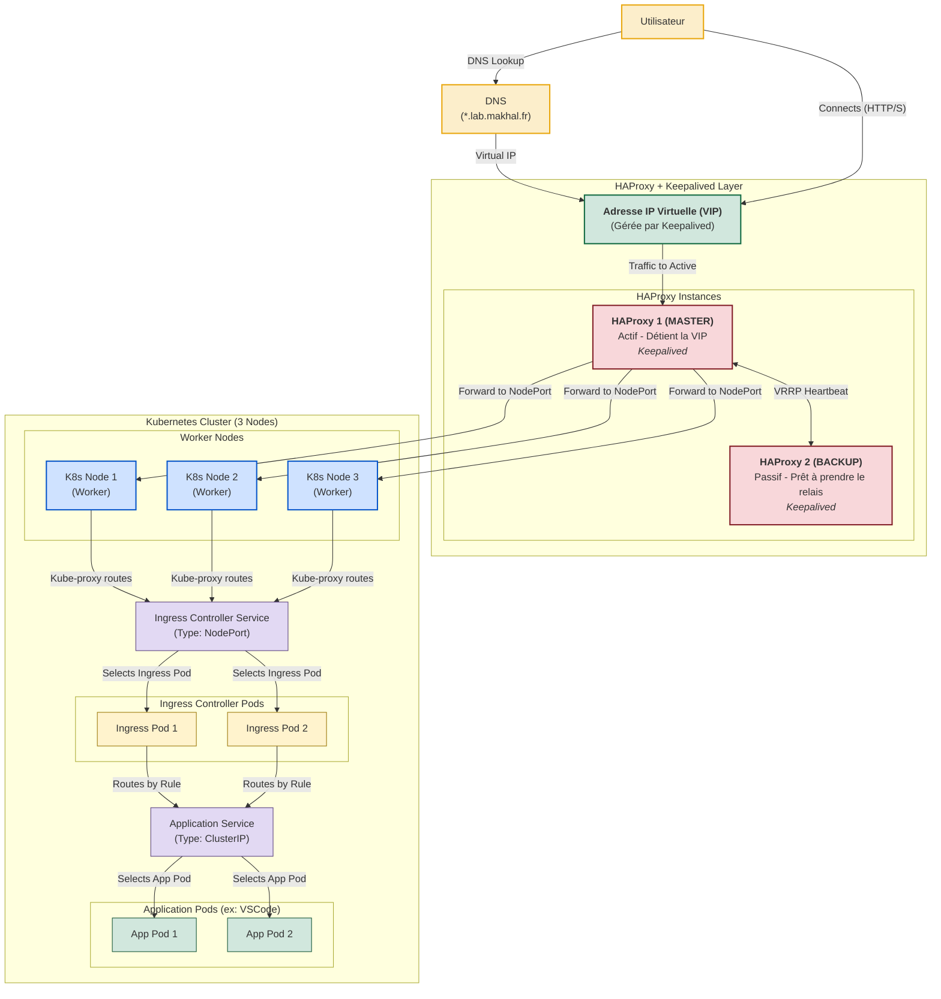

# LabOnDemand ✨

<div align="center">
    <h2 align="center"><a href="https://makhal.fr"></a></h2>
</div>

**LabOnDemand** est une plateforme open-source de gestion de laboratoires virtuels, conçue pour permettre aux étudiants et professeurs de créer et gérer facilement des environnements de travail isolés sur Kubernetes. Déployez des instances VS Code, Jupyter Notebooks, ou vos propres applications conteneurisées en quelques clics !

[](https://www.gnu.org/licenses/old-licenses/gpl-3.0.en.html)
<!-- Ajoutez d'autres badges ici (build status, etc.) quand ils seront pertinents -->

## 📹 Présentation du Projet

Regardez notre vidéo de présentation qui explique les principales fonctionnalités et l'utilisation de LabOnDemand :

[](Diagrammes/Video/LabOnDemand.mp4)

## 🚀 Fonctionnalités Clés

*   **Déploiement Facile :** Interface web intuitive pour lancer des environnements pré-configurés (VS Code, Jupyter) ou des images Docker personnalisées.
*   **Gestion Kubernetes Simplifiée :** Interagit avec l'API Kubernetes pour créer déploiements, services et gérer les ressources (CPU/Mémoire).
*   **Isolation :** Chaque laboratoire est déployé dans son propre namespace (optionnel) pour une meilleure organisation et isolation.
*   **Configuration des Ressources :** Préréglages de CPU/Mémoire pour adapter les environnements aux besoins spécifiques.
*   **Accès Simplifié :** Exposition automatique des services via NodePort (configurable pour d'autres types).
*   **Visualisation :** Tableau de bord pour suivre les laboratoires actifs, les namespaces, pods et déploiements Kubernetes gérés par l'application.
*   **Templates :** Support pour des templates de déploiement (VS Code, Jupyter, personnalisés) avec des images Docker dédiées.
*   **Validation Intégrée :** Formatage et validation des noms pour la conformité Kubernetes.
*   **Scalabilité :** Prêt pour une architecture haute disponibilité (voir schéma futur).

## 🏗️ Architecture du Projet

LabOnDemand est structuré autour de trois composants principaux :

1.  **Backend API (FastAPI/Python)** : Le cerveau de l'application. Il gère la logique métier, les interactions avec l'API Kubernetes et expose les endpoints pour le frontend.
2.  **Frontend (HTML/JavaScript/CSS)** : L'interface utilisateur web, permettant aux utilisateurs d'interagir avec l'API pour gérer leurs laboratoires.
3.  **Base de Données (MariaDB)** : Utilisée pour stocker les informations relatives aux laboratoires, utilisateurs (fonctionnalité future), et configurations.
4.  **Proxy NGINX** : Sert le frontend statique et redirige les appels API vers le backend FastAPI.

##  visionary Architecture (Objectif à Terme)

L'objectif est de faire évoluer LabOnDemand vers une solution robuste et hautement disponible :



## 🛠️ Mise en Place (Développement Local)

### Prérequis

*   **Docker & Docker Compose :** Pour construire et lancer les services localement.
*   **Cluster Kubernetes Fonctionnel :** Minikube, Kind, K3s, ou un cluster distant.
*   **`kubectl` :** Configuré pour interagir avec votre cluster.
*   **Helm (Optionnel, mais recommandé) :** Pour l'installation de l'Ingress Controller.
*   **Fichier `kubeconfig` :** Un fichier `kubeconfig` valide pour l'accès à votre cluster Kubernetes.

### Configuration Initiale

1.  **Clonez le dépôt :**
    ```bash
    git clone <URL_DU_DEPOT_LABONDEMAND>
    cd LabOnDemand
    ```

2.  **Configuration Kubernetes :**
    *   **⚠️ Configuration et Accès au Cluster :** L'application nécessite l'accès à un cluster Kubernetes via un fichier `kubeconfig`.
        *   **Pour le développement local avec Docker Compose :**
            Le fichier `kubeconfig.yaml` est monté comme un volume en lecture seule dans le conteneur API via `compose.yaml` :
            ```yaml
            # Dans compose.yaml, pour le service 'api':
            volumes:
              - ./backend:/app/backend
              - ./.env:/app/.env
              - ./kubeconfig.yaml:/root/.kube/config:ro # Montez votre kubeconfig local en lecture seule
            ```
            Assurez-vous que votre fichier `kubeconfig.yaml` est valide et situé à la racine du projet.
        *   **Pour un déploiement en cluster (Production) :** L'API devrait utiliser un **ServiceAccount Kubernetes** avec les permissions RBAC appropriées. Ne jamais embarquer un `kubeconfig` avec des droits étendus dans une image.
        *   **Besoin d'aide pour créer un cluster Kubernetes ?** Consultez notre tutoriel sur [Comment installer un cluster Kubernetes](https://makhal.fr/posts/k8s/k8s1-3/) qui vous guidera à travers le processus d'installation.

3.  **Fichier d'Environnement :**
    Créez un fichier `.env` à la racine du projet à partir de l'exemple (s'il n'y a pas de `.env.example`, créez-le) :
    ```bash
    cp .env.example .env # Ou créez .env manuellement
    ```
    Modifiez `.env` avec vos configurations (ports, identifiants de base de données) :
    ```dotenv
    # Exemple de .env
    API_PORT=8000
    FRONTEND_PORT=80
    DB_PORT=3306
    DB_ROOT_PASSWORD=supersecretrootpassword
    DB_USER=labondemand
    DB_PASSWORD=labondemandpassword
    DB_NAME=labondemand
    # DEBUG_MODE=True # Décommentez pour le mode debug de FastAPI/Uvicorn
    ```

4.  **(Optionnel) Installation de l'Ingress Controller NGINX :**
    Si vous souhaitez utiliser un Ingress pour exposer vos services (recommandé pour une utilisation plus avancée que NodePort) :
    ```bash
    helm repo add ingress-nginx https://kubernetes.github.io/ingress-nginx
    helm repo update
    helm install nginx-ingress ingress-nginx/ingress-nginx --namespace ingress-nginx --create-namespace
    ```

### Démarrage de l'Application

Lancez l'ensemble des services avec Docker Compose :

```bash
docker compose up -d --build
```

Une fois démarré, l'application sera accessible aux adresses suivantes (par défaut) :

*   **Frontend LabOnDemand :** [http://localhost](http://localhost) (ou `http://localhost:${FRONTEND_PORT}`)
*   **API LabOnDemand :** [http://localhost:8000](http://localhost:8000) (ou `http://localhost:${API_PORT}`)
*   **Documentation API (Swagger UI) :** [http://localhost:8000/docs](http://localhost:8000/docs)
*   **Documentation API (ReDoc) :** [http://localhost:8000/redoc](http://localhost:8000/redoc)

## 📁 Structure des Fichiers

```
└── tutanka01-labondemand/
    ├── readme.md           # Ce fichier
    ├── compose.yaml        # Configuration Docker Compose
    ├── Dockerfile          # Dockerfile pour l'API backend
    ├── LICENSE             # Licence du projet
    ├── requirements.txt    # Dépendances Python pour le backend
    ├── .env.example        # Modèle pour le fichier .env (À CRÉER SI MANQUANT)
    ├── backend/
    │   └── main.py         # Logique de l'API FastAPI et interaction Kubernetes
    ├── Diagrammes/         # Schémas d'architecture
    │   ├── Diagramme-API.drawio
    │   └── diagramme.md
    ├── dockerfiles/        # Dockerfiles pour les images des laboratoires
    │   ├── jupyter/
    │   │   └── Dockerfile
    │   └── vscode/
    │       └── Dockerfile
    ├── frontend/           # Fichiers de l'interface utilisateur web
    │   ├── index.html
    │   ├── script.js
    │   ├── style.css
    │   └── css/
    │       ├── app-status.css
    │       └── lab-status.css
    └── nginx/
        └── nginx.conf      # Configuration du proxy NGINX
```

## 💡 Développement et Maintenance

### Contribution au Projet

Nous encourageons les contributions au projet LabOnDemand ! Voici comment vous pouvez participer :

1. **Fork** le dépôt GitHub
2. **Créez une branche** pour votre fonctionnalité ou correction
3. **Commitez vos changements** avec des messages clairs
4. **Faites une Pull Request** vers le dépôt principal

### Ressources et Documentation Supplémentaires

Pour vous aider dans votre utilisation et développement avec LabOnDemand, voici quelques ressources additionnelles :

* **[Installation d'un Cluster Kubernetes](https://makhal.fr/posts/k8s/k8s1-3/)** - Guide détaillé pour mettre en place votre propre cluster Kubernetes
* **[Documentation Kubernetes Officielle](https://kubernetes.io/fr/docs/home/)** - Référence complète pour l'utilisation de Kubernetes
* **[FastAPI Documentation](https://fastapi.tiangolo.com/)** - Documentation de FastAPI, utilisé pour le backend de l'application

## 📝 Licence

Ce projet est sous licence [GNU General Public License v3.0](LICENSE) - voir le fichier LICENSE pour plus de détails.

---

© 2025 LabOnDemand - Créé avec ❤️ pour simplifier le déploiement d'environnements d'apprentissage.
