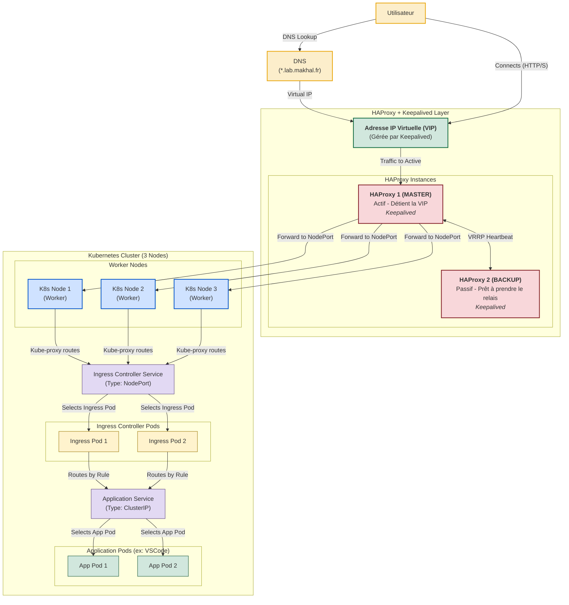

# LabOnDemand ✨

**LabOnDemand** est une plateforme open-source de gestion de laboratoires virtuels, conçue pour permettre aux étudiants et professeurs de créer et gérer facilement des environnements de travail isolés sur Kubernetes. Déployez des instances VS Code, Jupyter Notebooks, ou vos propres applications conteneurisées en quelques clics !

[](https://www.gnu.org/licenses/old-licenses/gpl-3.0.en.html)
<!-- Ajoutez d'autres badges ici (build status, etc.) quand ils seront pertinents -->

## 🚀 Fonctionnalités Clés

*   **Déploiement Facile :** Interface web intuitive pour lancer des environnements pré-configurés (VS Code, Jupyter) ou des images Docker personnalisées.
*   **Gestion Kubernetes Simplifiée :** Interagit avec l'API Kubernetes pour créer déploiements, services et gérer les ressources (CPU/Mémoire).
*   **Isolation :** Chaque laboratoire est déployé dans son propre namespace (optionnel) pour une meilleure organisation et isolation.
*   **Configuration des Ressources :** Préréglages de CPU/Mémoire pour adapter les environnements aux besoins spécifiques.
*   **Accès Simplifié :** Exposition automatique des services via NodePort (configurable pour d'autres types).
*   **Visualisation :** Tableau de bord pour suivre les laboratoires actifs, les namespaces, pods et déploiements Kubernetes gérés par l'application.
*   **Templates :** Support pour des templates de déploiement (VS Code, Jupyter, personnalisés) avec des images Docker dédiées.
*   **Validation Intégrée :** Formatage et validation des noms pour la conformité Kubernetes.
*   **Scalabilité :** Prêt pour une architecture haute disponibilité (voir schéma futur).

## 🏗️ Architecture du Projet

LabOnDemand est structuré autour de trois composants principaux :

1.  **Backend API (FastAPI/Python)** : Le cerveau de l'application. Il gère la logique métier, les interactions avec l'API Kubernetes et expose les endpoints pour le frontend.
2.  **Frontend (HTML/JavaScript/CSS)** : L'interface utilisateur web, permettant aux utilisateurs d'interagir avec l'API pour gérer leurs laboratoires.
3.  **Base de Données (MariaDB)** : Utilisée pour stocker les informations relatives aux laboratoires, utilisateurs (fonctionnalité future), et configurations.
4.  **Proxy NGINX** : Sert le frontend statique et redirige les appels API vers le backend FastAPI.

##  visionary Architecture (Objectif à Terme)

L'objectif est de faire évoluer LabOnDemand vers une solution robuste et hautement disponible :



## 🛠️ Mise en Place (Développement Local)

### Prérequis

*   **Docker & Docker Compose :** Pour construire et lancer les services localement.
*   **Cluster Kubernetes Fonctionnel :** Minikube, Kind, K3s, ou un cluster distant.
*   **`kubectl` :** Configuré pour interagir avec votre cluster.
*   **Helm (Optionnel, mais recommandé) :** Pour l'installation de l'Ingress Controller.
*   **Fichier `kubeconfig` :** Un fichier `kubeconfig` valide pour l'accès à votre cluster Kubernetes.

### Configuration Initiale

1.  **Clonez le dépôt :**
    ```bash
    git clone <URL_DU_DEPOT_LABONDEMAND>
    cd LabOnDemand
    ```

2.  **Configuration Kubernetes :**
    *   **⚠️ Sécurité Importante :** Le `Dockerfile` actuel copie `kubeconfig.yaml` dans l'image de l'API. **CECI N'EST PAS SÉCURISÉ POUR LA PRODUCTION.**
        *   **Pour le développement local avec Docker Compose :**
            Le `Dockerfile` copie `kubeconfig.yaml` vers `/root/.kube/config` dans l'image. Assurez-vous que votre fichier `kubeconfig.yaml` est à la racine du projet.
            Alternativement, vous pouvez monter votre `kubeconfig` local via un volume dans `compose.yaml` :
            ```yaml
            # Dans compose.yaml, pour le service 'api':
            volumes:
              - ./backend:/app/backend
              - ./.env:/app/.env
              - ~/.kube/config:/root/.kube/config:ro # Montez votre kubeconfig local en lecture seule
            ```
            Si vous utilisez cette méthode de montage, supprimez la ligne `COPY kubeconfig.yaml /root/.kube/config` du `Dockerfile` de l'API.
        *   **Pour un déploiement en cluster (Production) :** L'API devrait utiliser un **ServiceAccount Kubernetes** avec les permissions RBAC appropriées. Ne jamais embarquer un `kubeconfig` avec des droits étendus dans une image.

3.  **Fichier d'Environnement :**
    Créez un fichier `.env` à la racine du projet à partir de l'exemple (s'il n'y a pas de `.env.example`, créez-le) :
    ```bash
    cp .env.example .env # Ou créez .env manuellement
    ```
    Modifiez `.env` avec vos configurations (ports, identifiants de base de données) :
    ```dotenv
    # Exemple de .env
    API_PORT=8000
    FRONTEND_PORT=80
    DB_PORT=3306
    DB_ROOT_PASSWORD=supersecretrootpassword
    DB_USER=labondemand
    DB_PASSWORD=labondemandpassword
    DB_NAME=labondemand
    # DEBUG_MODE=True # Décommentez pour le mode debug de FastAPI/Uvicorn
    ```

4.  **(Optionnel) Installation de l'Ingress Controller NGINX :**
    Si vous souhaitez utiliser un Ingress pour exposer vos services (recommandé pour une utilisation plus avancée que NodePort) :
    ```bash
    helm repo add ingress-nginx https://kubernetes.github.io/ingress-nginx
    helm repo update
    helm install nginx-ingress ingress-nginx/ingress-nginx --namespace ingress-nginx --create-namespace
    ```

### Démarrage de l'Application

Lancez l'ensemble des services avec Docker Compose :

```bash
docker compose up -d --build
```

Une fois démarré, l'application sera accessible aux adresses suivantes (par défaut) :

*   **Frontend LabOnDemand :** [http://localhost](http://localhost) (ou `http://localhost:${FRONTEND_PORT}`)
*   **API LabOnDemand :** [http://localhost:8000](http://localhost:8000) (ou `http://localhost:${API_PORT}`)
*   **Documentation API (Swagger UI) :** [http://localhost:8000/docs](http://localhost:8000/docs)
*   **Documentation API (ReDoc) :** [http://localhost:8000/redoc](http://localhost:8000/redoc)

## 📁 Structure des Fichiers

```
└── tutanka01-labondemand/
    ├── readme.md           # Ce fichier
    ├── compose.yaml        # Configuration Docker Compose
    ├── Dockerfile          # Dockerfile pour l'API backend
    ├── LICENSE             # Licence du projet
    ├── requirements.txt    # Dépendances Python pour le backend
    ├── .env.example        # Modèle pour le fichier .env (À CRÉER SI MANQUANT)
    ├── backend/
    │   └── main.py         # Logique de l'API FastAPI et interaction Kubernetes
    ├── Diagrammes/         # Schémas d'architecture
    │   ├── Diagramme-API.drawio
    │   └── diagramme.md
    ├── dockerfiles/        # Dockerfiles pour les images des laboratoires
    │   ├── jupyter/
    │   │   └── Dockerfile
    │   └── vscode/
    │       └── Dockerfile
    ├── frontend/           # Fichiers de l'interface utilisateur web
    │   ├── index.html
    │   ├── script.js
    │   ├── style.css
    │   └── css/
    │       ├── app-status.css
    │       └── lab-status.css
    └── nginx/
        └── nginx.conf      # Configuration du proxy NGINX
```

## 💡 Développement et Maintenance

### Étendre le Backend

1.  Ajoutez de nouveaux endpoints ou modifiez ceux existants dans `backend/main.py`.
2.  Utilisez le client Python Kubernetes pour interagir avec votre cluster.
3.  N'oubliez pas d'ajouter des modèles Pydantic pour la validation des données d'entrée/sortie.

### Modifier le Frontend

1.  Le frontend est en HTML, CSS vanilla et JavaScript vanilla.
2.  Les appels API sont gérés dans `frontend/script.js`.
3.  Modifiez `frontend/index.html` pour la structure et `frontend/style.css` (et les CSS dans `frontend/css/`) pour l'apparence.

### Personnaliser les Images des Laboratoires

1.  Créez un nouveau Dockerfile dans `dockerfiles/` (par exemple, `dockerfiles/mon_app/Dockerfile`).
2.  Référencez cette nouvelle image dans la fonction `get_deployment_templates()` du backend (`backend/main.py`) et mettez à jour le frontend si nécessaire.
3.  Pensez à pousser vos images Docker personnalisées sur un registre (Docker Hub, GHCR, etc.) si elles doivent être accessibles par le cluster Kubernetes.

### Dépannage

*   **Logs Docker :** `docker compose logs -f <nom_du_service>` (ex: `docker compose logs -f api`)
*   **Logs Kubernetes :** `kubectl logs -n <namespace> <nom_du_pod>`
*   **Erreurs API :** Vérifiez la console du navigateur et la documentation Swagger UI (`/docs`).

## 🗺️ Roadmap & Fonctionnalités Futures

Nous avons de grandes ambitions pour LabOnDemand ! Voici quelques idées pour l'avenir :

*   🔐 **Authentification & Autorisation :**
    *   Système de connexion pour utilisateurs (OAuth2/OIDC).
    *   Rôles (étudiant, professeur, admin) avec permissions distinctes.
*   💾 **Persistance des Données :**
    *   Support des `PersistentVolumeClaims` pour sauvegarder le travail.
    *   Montage de datasets spécifiques pour les environnements (ex: Jupyter).
*   📊 **Gestion des Ressources & Quotas :**
    *   Limites par utilisateur/groupe (CPU, mémoire, nombre de labs).
    *   Nettoyage automatique des labs inactifs.
*   🌐 **Networking Avancé :**
    *   Intégration complète avec un Ingress Controller pour des URLs personnalisées (ex: `monlab.lab.makhal.fr`).
    *   Support des `NetworkPolicies` pour l'isolation.
*   🧩 **Templates Améliorés :**
    *   Permettre la configuration de variables d'environnement et de ports spécifiques par template.
    *   Interface pour que les administrateurs/professeurs créent leurs propres templates.
*   ⚙️ **Interface d'Administration :**
    *   Gestion des utilisateurs, templates globaux, quotas.
    *   Monitoring de l'utilisation des ressources.
*   🖥️ **Améliorations UX :**
    *   Visualisation des logs des pods et accès terminal depuis l'interface.

## 🙌 Contribuer

Les contributions sont les bienvenues ! Que ce soit pour signaler un bug, proposer une fonctionnalité, ou soumettre du code, votre aide est précieuse.

1.  **Signaler des Problèmes (Issues) :**
    Utilisez l'onglet "Issues" du dépôt GitHub pour signaler des bugs ou suggérer des améliorations. Veuillez fournir autant de détails que possible.
2.  **Proposer des Modifications (Pull Requests) :**
    *   Forkez le dépôt.
    *   Créez une nouvelle branche pour votre fonctionnalité ou correction (`git checkout -b feature/ma-super-feature` ou `fix/corriger-ce-bug`).
    *   Faites vos modifications et commitez-les avec des messages clairs.
    *   Poussez votre branche vers votre fork (`git push origin feature/ma-super-feature`).
    *   Ouvrez une Pull Request vers la branche `main` (ou `develop` si elle existe) du dépôt original.

N'hésitez pas à discuter des changements majeurs dans une Issue avant de commencer le développement.

## 📜 Licence

Ce projet est sous licence GNU General Public License v3.0. Voir le fichier [LICENSE](LICENSE) pour plus de détails.

---

Fait avec ❤️ et ☕ par Mohamad El Akhal
