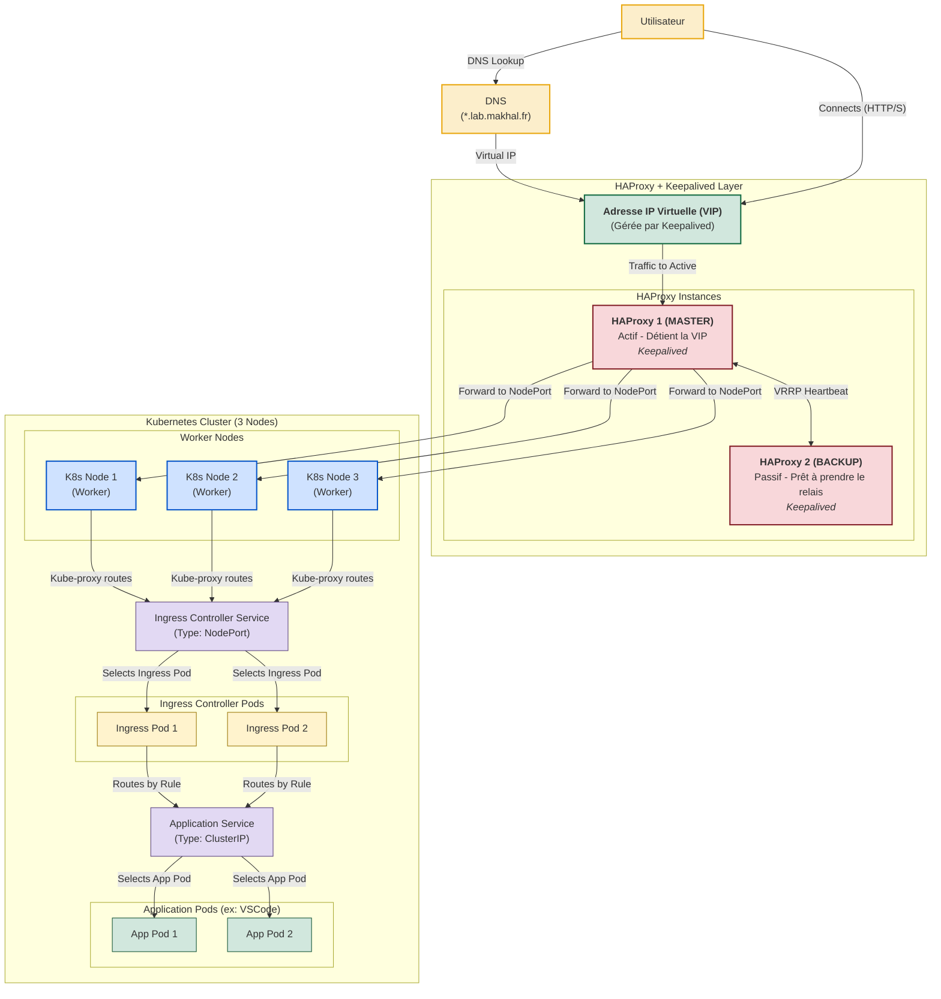

# LabOnDemand

LabOnDemand est une solution de gestion de laboratoires virtuels permettant aux étudiants et professeurs de créer des environnements de travail isolés sur Kubernetes.

## Architecture du projet

Le projet se compose de trois parties principales :

1. **API Backend (FastAPI/Python)** : Gère les interactions avec Kubernetes
2. **Interface Frontend (HTML/JavaScript)** : Permet aux utilisateurs d'interagir avec l'API
3. **Base de données (MariaDB)** : Stocke les informations relatives aux laboratoires et utilisateurs

## Future de l'application

A terme l'application devra ressembler au schéma ci-dessous :


## Fonctionnalités actuelles

- Affichage des namespaces Kubernetes
- Affichage des pods en cours d'exécution
- Création de nouveaux pods à partir d'images Docker
- Création d'environnements VS Code accessibles par navigateur
- Configuration des ressources (CPU/Mémoire) selon les besoins
- Interface utilisateur web intuitive pour gérer les ressources
- Support pour les services Kubernetes avec NodePort

## Fonctionnalités techniques

- Gestion complète des déploiements et services Kubernetes
- Support des templates de déploiement (VS Code, déploiements personnalisés)
- Préréglages de ressources (CPU et mémoire) pour simplifier la configuration
- Exposition automatique des services via NodePort
- Validation et formatage des noms conformes à Kubernetes
- Vérification de l'état des pods et des déploiements

## Mise en place du projet

### Prérequis

- Docker et Docker Compose pour le développement local
- Un cluster Kubernetes fonctionnel
- Helm pour l'installation de l'Ingress Controller
- Un fichier kubeconfig.yaml valide pour l'accès au cluster Kubernetes

### Installation et configuration

1. Clonez ce dépôt
2. Créez un fichier `.env` à la racine (voir `.env.example`)
3. Placez votre fichier `kubeconfig.yaml` à la racine du projet

### Installation de l'Ingress Controller NGINX

Pour exposer correctement les services, installez l'Ingress Controller NGINX avec Helm :

```bash
helm install nginx-ingress ingress-nginx/ingress-nginx --namespace ingress-nginx --create-namespace
```

### Démarrage de l'application

Lancez l'application avec Docker Compose :

```bash
docker compose up -d
```

L'application sera accessible aux adresses suivantes :
- Frontend : http://localhost
- API : http://localhost:8000
- Documentation API (Swagger) : http://localhost:8000/docs

## Architecture détaillée

### Backend (FastAPI/Python)

Le backend est développé avec FastAPI et communique avec l'API Kubernetes pour gérer les ressources du cluster. Il offre les fonctionnalités suivantes :

- Création/suppression de déploiements et services
- Gestion des ressources des conteneurs (CPU, mémoire)
- Récupération des informations sur les pods, déploiements et services
- Templates prédéfinis (VS Code, etc.)
- Préréglages de ressources adaptés à différents cas d'usage

### Frontend (HTML/JavaScript)

L'interface utilisateur permet de :

- Visualiser l'état des pods et déploiements
- Créer de nouveaux environnements à partir de templates
- Configurer les ressources avec des préréglages simples
- Consulter les détails des déploiements et accéder aux services exposés

### Proxy NGINX

NGINX sert de proxy inverse pour :
- Servir le frontend statique
- Rediriger les requêtes API vers le backend FastAPI
- Gérer les chemins d'accès et les en-têtes HTTP

## Structure des fichiers

- `backend/` : Code source de l'API Python (FastAPI)
  - `main.py` : Points d'entrée de l'API et logique Kubernetes
- `frontend/` : Interface utilisateur
  - `index.html` : Structure principale de l'interface
  - `js/main.js` : Logique JavaScript et appels API
  - `css/` : Styles de l'interface
- `nginx/` : Configuration du serveur web
- `dockerfiles/` : Dockerfiles spécifiques (comme pour VS Code)
- `Dockerfile` : Construction de l'image pour l'API
- `compose.yaml` : Configuration des services Docker

## Développement et maintenance

### Extension du backend

Pour ajouter de nouvelles fonctionnalités au backend :
1. Implémentez de nouveaux endpoints dans `backend/main.py`
2. Suivez le modèle existant pour la validation des entrées
3. Utilisez l'API client Kubernetes pour interagir avec le cluster

### Modification du frontend

Le frontend utilise JavaScript vanille et Bootstrap pour l'interface :
1. Les appels API sont centralisés dans `frontend/js/main.js`
2. Les templates de déploiement peuvent être étendus depuis l'API

### Personnalisation des images

Pour ajouter de nouveaux templates d'environnements :
1. Créez un nouveau Dockerfile dans le dossier `dockerfiles/`
2. Ajoutez le template dans la fonction `get_deployment_templates()` du backend
3. Mettez à jour l'interface pour prendre en charge le nouveau template

### Résolution des problèmes

En cas de problèmes avec les ressources (comme l'erreur du préréglage VS Code) :
1. Vérifiez les limitations définies dans le backend (`main.py`)
2. Assurez-vous que le frontend passe correctement les paramètres au backend
3. Consultez les logs Docker pour plus d'informations sur les erreurs

## Personnalisation des configurations

### Ressources des conteneurs

Les préréglages de ressources sont définis dans la fonction `get_resource_presets()` et peuvent être modifiés selon les besoins.