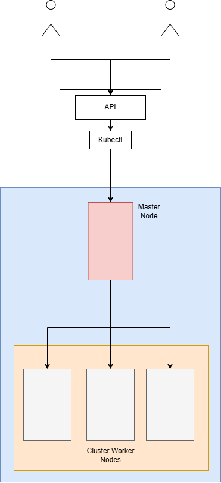

# LabOnDemand

LabOnDemand est une solution de gestion de laboratoires virtuels permettant aux étudiants et professeurs de créer des environnements de travail isolés sur Kubernetes.

## Architecture du projet

Le projet se compose de trois parties principales :

1. **API Backend (FastAPI/Python)** : Gère les interactions avec Kubernetes
2. **Interface Frontend (HTML/JavaScript)** : Permet aux utilisateurs d'interagir avec l'API
3. **Base de données (MariaDB)** : Stocke les informations relatives aux laboratoires et utilisateurs



## Fonctionnalités actuelles

- Affichage des namespaces Kubernetes
- Affichage des pods en cours d'exécution
- Création de nouveaux pods à partir d'images Docker
- Interface utilisateur web pour gérer les ressources

## Mise en place du projet

### Prérequis

- Docker et Docker Compose
- Un fichier kubeconfig.yaml valide pour l'accès à un cluster Kubernetes

### Installation et démarrage

1. Clonez ce dépôt
2. Créez un fichier `.env` à la racine (voir `.env.example`)
3. Placez votre fichier `kubeconfig.yaml` à la racine du projet
4. Lancez l'application avec Docker Compose :

```bash
docker compose up -d
```

L'application sera accessible aux adresses suivantes :
- Frontend : http://localhost
- API : http://localhost:8000
- Documentation API (Swagger) : http://localhost:8000/docs

## Structure des fichiers

- `backend/` : Code source de l'API Python
- `frontend/` : Interface utilisateur (HTML, CSS, JavaScript)
- `nginx/` : Configuration du serveur web
- `Dockerfile` : Construction de l'image pour l'API
- `compose.yaml` : Configuration des services Docker

## Développement

Pour contribuer au développement :

1. L'API est développée avec FastAPI et peut être étendue en ajoutant des endpoints dans `backend/main.py`
2. L'interface utilisateur est développée en HTML/CSS/JS et se trouve dans le dossier `frontend/`
3. La configuration Docker peut être modifiée via les fichiers `Dockerfile` et `compose.yaml`