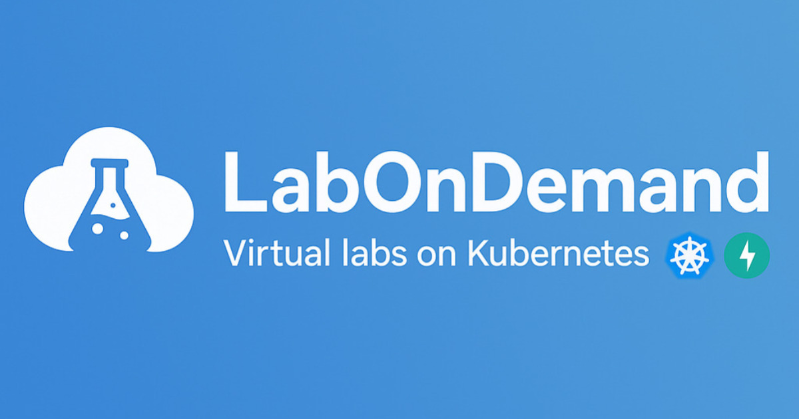

# LabOnDemand

<div align="center">
    <h2 align="center"><a href="https://makhal.fr"></a></h2>
</div>

**LabOnDemand** est une plateforme open-source permettant aux enseignants et étudiants de déployer des environnements de laboratoire isolés (VS Code, Jupyter, WordPress, LAMP, MySQL…) sur Kubernetes, sans connaissances Kubernetes.

[](https://www.gnu.org/licenses/agpl-3.0)

## Démarrage rapide

```bash
git clone <repo> && cd LabOnDemand
cp .env.exemple .env          # adapter ADMIN_DEFAULT_PASSWORD, REDIS_PASSWORD et CLUSTER_EXTERNAL_IP
nano kubeconfig.yaml          # secret local: ne pas versionner
docker compose up --build
# → API sur http://localhost:8000  |  Frontend sur http://localhost
# → Compte admin: admin / valeur de ADMIN_DEFAULT_PASSWORD
```

Voir [documentation/development-setup.md](documentation/development-setup.md) pour la configuration complète (.env, kubeconfig, stockage persistant).

## Fonctionnalités

- **Déploiements en 1 clic** : VS Code, Jupyter, WordPress + MariaDB, MySQL + phpMyAdmin, LAMP, ou image Docker personnalisée
- **RBAC** : rôles student / teacher / admin avec quotas CPU/RAM enforced côté serveur
- **Terminal web** intégré (Xterm.js, WebSocket) — accès shell aux pods sans SSH
- **Ingress automatique** : sous-domaine par déploiement avec TLS optionnel (cert-manager)
- **Système de classes** : enseignants créent des classes, inscrivent des étudiants, publient des devoirs avec déploiement en masse
- **Devoirs et soumissions** : instructions Markdown, livrables, date limite, soumission texte + liens
- **Tests automatiques (Grader Pod)** : sondes boîte noire (http, tcp, sql, script) exécutées dans un Job Kubernetes isolé ; progression check par check côté étudiant, triage avec verdict `x/y` + note suggérée côté enseignant, correction humaine finale
- **SSO / OIDC** : intégration avec les IdP universitaires (CAS, Keycloak, etc.)
- **Sessions Redis** distribuées — mot de passe, réseau interne, cookie HttpOnly, SameSite, Secure
- **Logging structuré JSON** avec rotation (`logs/app.log`, `access.log`, `audit.log`)
- **Volumes persistants** : PVC automatiques avec fallback `emptyDir` si pas de StorageClass
- **Templates dynamiques** : bibliothèque de déploiements configurable depuis l'interface admin
- **UI bilingue** : français / anglais (i18n intégré)

## Documentation

| Document | Contenu |
|---|---|
| [architecture.md](documentation/architecture.md) | Structure du code, flux d'une requête, RBAC, Ingress |
| [development-setup.md](documentation/development-setup.md) | Setup local, variables .env, migrations |
| [testing.md](documentation/testing.md) | Suite de tests automatisés (pytest, fixtures, mocks) |
| [security.md](documentation/security.md) | Sessions, RBAC, mots de passe, OIDC, secrets K8s |
| [lifecycle.md](documentation/lifecycle.md) | TTL et nettoyage automatique des labs Kubernetes |
| [assignment-lifecycle.md](documentation/assignment-lifecycle.md) | Cycle de vie des devoirs, soumissions et corrections |
| [grader-pod.md](documentation/grader-pod.md) | Grader Pod : Job K8s isolé, modèle pull, sécurité, contrat des probes |
| [authentication.md](documentation/authentication.md) | Auth locale et SSO détaillé |
| [storage.md](documentation/storage.md) | Volumes persistants, PVC, StorageClass |
| [troubleshooting.md](documentation/troubleshooting.md) | Problèmes courants et solutions |
| [platform-setup.md](documentation/platform-setup.md) | Installation K3s + Ingress + MetalLB |
| [lamp.md](documentation/lamp.md) | Stack LAMP |
| [wordpress.md](documentation/wordpress.md) | Stack WordPress |
| [terminal.md](documentation/terminal.md) | Terminal web WebSocket |
| [logging.md](documentation/logging.md) | Logging structuré |

## Stack technique

| Composant | Technologie |
|---|---|
| Backend API | FastAPI (Python 3.13) + SQLAlchemy 2 |
| Frontend | React 18 / TypeScript / Vite / Tailwind CSS / Radix UI |
| Base de données | MariaDB + PyMySQL |
| Sessions | Redis (store côté serveur, cookie HttpOnly) |
| Orchestration | Kubernetes via client Python officiel |
| Proxy | Nginx |
| Auth SSO | OIDC / OAuth2 |
| Tests | pytest (SQLite in-memory, Redis fake, K8s mocké) |

## Licence

AGPL v3 — voir [LICENSE](LICENSE).
